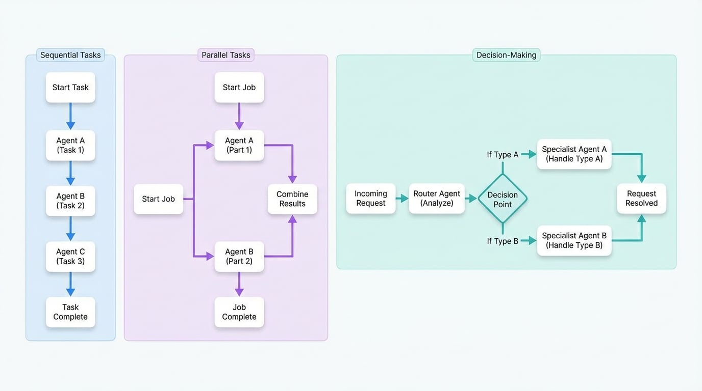

# Common Workflows

In the AIGNE Framework, a single agent can perform a specific task. However, the true power of the system is realized when multiple agents collaborate to solve more complex problems. Just like members of a team, agents can be organized to work together in structured ways. These patterns of collaboration are called "workflows."

Workflows define how tasks and information flow between different agents to achieve a larger goal. By arranging agents in different patterns, we can create sophisticated automated processes for various business needs.

The diagram below illustrates three fundamental workflow patterns.

<!-- DIAGRAM_IMAGE_START:flowchart:16:9 -->

<!-- DIAGRAM_IMAGE_END -->

This guide introduces the most common workflows you'll encounter. Understanding these patterns will help you visualize how agents can automate complex, multi-step processes for you.

Explore the detailed explanations for each workflow to learn more about their specific use cases and benefits.

<x-cards data-columns="3">
  <x-card data-title="Sequential Tasks" data-icon="lucide:list-ordered" data-href="/user-guide/common-workflows/sequential-tasks">
    Like an assembly line, agents complete tasks one after another, passing their work to the next agent in line. This is ideal for processes that must happen in a specific order.
  </x-card>
  <x-card data-title="Parallel Tasks" data-icon="lucide:git-fork" data-href="/user-guide/common-workflows/parallel-tasks">
    To get things done faster, multiple agents can work on different parts of a job at the same time. Their individual results are then combined to form a complete solution.
  </x-card>
  <x-card data-title="Decision-Making" data-icon="lucide:git-merge" data-href="/user-guide/common-workflows/decision-making">
    Just like a manager, one agent can analyze an incoming request and intelligently route it to the most suitable specialist agent to handle the job.
  </x-card>
</x-cards>

By combining these fundamental patterns, you can build powerful and autonomous systems tailored to your specific needs. Click on any card to dive deeper into how each workflow operates.