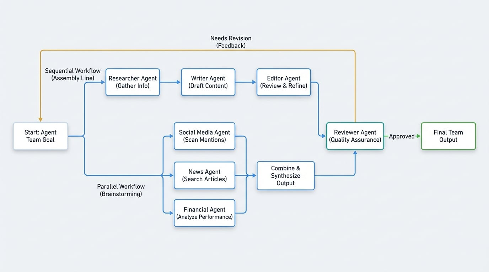

# Agent チーム

単一の特化した Agent は特定のタスクに役立ちますが、1 つの Agent だけで処理するには大きすぎる、または複雑すぎる問題もあります。人間の組織と同様に、タスクに複数のステップや多様なスキルが必要な場合は、チームを編成します。AIGNE では、Agent チームとは、より大きな目標を解決するために協力して編成された Agent のグループです。

このように考えてみてください。[基本 Agent](./user-guide-understanding-agents-basic-agents.md) がグラフィックデザイナーのようなスペシャリストであるとすれば、Agent チームはコピーライター、ストラテジスト、デザイナーを含むマーケティング部門全体であり、全員がキャンペーンに共同で取り組んでいます。

## Agent チームの連携方法

Agent チームは、タスクの性質に応じて、さまざまな方法で連携するように設定できます。主な連携モードには、シーケンシャルとパラレルの 2 つがあります。

### シーケンシャルワークフロー：組み立てライン

シーケンシャルワークフローでは、Agent は特定の順序で次々とタスクを実行します。最初の Agent の出力が 2 番目の Agent の入力となり、これが組み立てラインのように続きます。このアプローチは、各ステップが前のステップの完了に依存するプロセスに最適です。

たとえば、ブログ記事を作成するために、チームは次のように作業するかもしれません。
1.  **リサーチャー Agent：** トピックに関する情報と主要な事実を収集します。
2.  **ライター Agent：** 調査結果を基にブログ記事の草稿を作成します。
3.  **エディター Agent：** 文法とスタイルについて草稿をレビューし、最終版を提供します。

### パラレルワークフロー：ブレーンストーミングセッション

パラレルワークフローでは、チーム内のすべての Agent が同じ初期入力に対して同時に作業します。各 Agent は独立して専門タスクを実行し、それぞれの出力が結合されて最終結果が形成されます。これは、さまざまな専門家が同時に問題に対する独自の視点を持ち寄るブレーンストーミングセッションに似ています。

たとえば、市場センチメントを分析するために、チームは並行して作業できます。
*   **入力：** 会社名。
*   **ソーシャルメディア Agent：** Twitter での言及をスキャンします。
*   **ニュース Agent：** 最近のニュース記事を検索します。
*   **財務 Agent：** 最近の株価パフォーマンスを調べます。
*   **出力：** 3 つのレポートすべてが 1 つの包括的な市場分析に統合されます。

### リフレクション：品質保証ループ

より高度なパターンは「リフレクション」で、品質管理ステップを導入します。このモデルでは、チームがタスクを完了した後、特別な **レビュアー Agent** が出力を検査します。

*   作業が必要な基準を満たしている場合、レビュアーはそれを承認し、プロセスは完了します。
*   作業が満足のいくものでない場合、レビュアーはフィードバックを提供し、再試行のためにチームに差し戻します。

このループは、出力が承認されるか、最大試行回数に達するまで続きます。これにより、レビューと改善のサイクルをワークフローに直接組み込むことで、より高品質な結果が保証されます。

下の図は、これら 3 つの主要な連携パターンを示しています。

<!-- DIAGRAM_IMAGE_START:flowchart:16:9 -->

<!-- DIAGRAM_IMAGE_END -->

## まとめ

Agent をチームに編成することで、より複雑な多段階のワークフローを自動化できます。この協調的なアプローチにより、コンテンツ作成パイプラインからデータ分析、品質保証チェックまで、現実世界のビジネスプロセスを模倣した高度なソリューションを構築できます。

これらの概念が実際にどのように機能するかを確認するには、[一般的なワークフロー](./user-guide-common-workflows.md) に関するガイドをご覧ください。このガイドでは、Agent チームが実際の問題を解決する実践的な例を提供しています。実装に関する技術的な詳細については、開発者は [チーム Agent のドキュメント](./developer-guide-agents-team-agent.md) を参照してください。