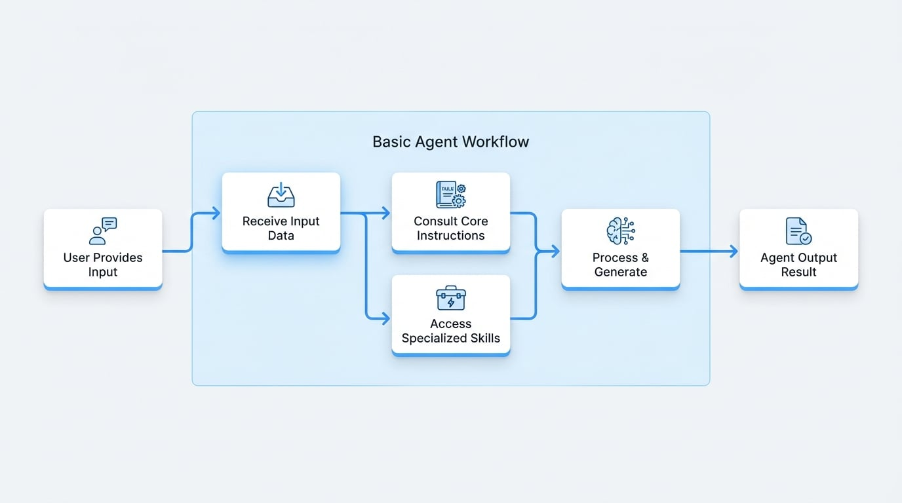

# 基本的な Agent

基本的な Agent とは、役立つチャットボットや集中的なデータ入力担当者のような、専門的なデジタルアシスタントだと考えてください。各 Agent は、特定の種類のタスクを1つだけ実行し、それをうまくこなすように設計されています。明確な指示セットに基づいて動作し、処理するための特定の入力を受け取り、結果を生成します。

これらの単一目的の Agent は、AIGNE の基本的な構成要素です。それ自体は単純ですが、組み合わせてはるかに複雑なワークフローを処理することができ、これについては [Agent Teams](./user-guide-understanding-agents-agent-teams.md) のセクションで詳しく説明します。

## Agent の構造

すべての基本的な Agent は、その機能に関係なく、いくつかのコアコンポーネントによって定義されます。これらの部分を理解することは、Agent が何をすべきかをどのように知るかを明確にするのに役立ちます。

<x-cards data-columns="2">
  <x-card data-title="指示" data-icon="lucide:book-marked">
    これは Agent の恒久的なルールブックまたは職務記述書です。Agent が誰であるか、その目的は何か、どのように振る舞うべきかを伝える詳細なガイドです。例えば、カスタマーサービス Agent の指示は次のようになります。「あなたはフレンドリーで親切なアシスタントです。あなたの目標は、顧客の質問に正確に答えることです。」
  </x-card>
  <x-card data-title="入力" data-icon="lucide:arrow-right-to-line">
    これは、特定の瞬間に Agent に与える特定の情報またはタスクです。Agent がチャットボットの場合、入力は「営業時間は？」のようなユーザーの質問になります。
  </x-card>
  <x-card data-title="出力" data-icon="lucide:arrow-left-from-line">
    これは、Agent が指示に従って入力を処理した後に生成する結果です。チャットボットの例では、出力は「当社の営業時間は月曜日から金曜日の午前9時から午後5時までです。」という回答になります。
  </x-card>
  <x-card data-title="スキル" data-icon="lucide:sparkles">
    これらは、Agent がタスクを実行するために使用できる特別なツールや能力です。例えば、「天気 Agent」は、外部サービスからリアルタイムの天気データにアクセスできるスキルを持っているかもしれません。
  </x-card>
</x-cards>

## Agent の仕組み

プロセスは簡単です。ユーザーが Agent に入力を提供します。その後、Agent はそのコアな指示を参照してコンテキストとルールを理解し、必要に応じて持っているスキルを使用し、出力を生成します。

<!-- DIAGRAM_IMAGE_START:flowchart:16:9 -->

<!-- DIAGRAM_IMAGE_END -->

## 例：シンプルなチャット Agent

「チャット Agent」の実用的な例を見てみましょう。この Agent は、質問に答える役立つアシスタントとして設計されています。その設定は次のようになります。

| プロパティ | 値 | 説明 |
| :--- | :--- | :--- |
| **名前** | `chat` | Agent のシンプルな識別子。 |
| **説明** | `Chat agent` | その目的の簡単な説明。 |
| **指示**| `あなたは役立つアシスタントです...` | これは Agent に、フレンドリーで有益な情報を提供するよう伝えます。 |
| **入力キー** | `message` | Agent は、ユーザーの質問が「message」としてラベル付けされることを期待します。 |
| **出力キー** | `message` | Agent は、その回答を「message」としてラベル付けします。 |

この Agent に `message: "How does an agent work?"` のような入力を送信すると、役立つようにという指示に従い、そのプログラミングに基づいて明確で有益な回答を提供します。

## まとめ

基本的な Agent とは、その指示、受け取る入力、そして生成する出力によって定義される、単一タスクのデジタルワーカーです。それらは AIGNE の不可欠な基礎コンポーネントです。特定のタスクには強力ですが、その真のポテンシャルは、より複雑な課題に取り組むために [Agent Teams](./user-guide-understanding-agents-agent-teams.md) に組み込まれたときに解き放たれます。