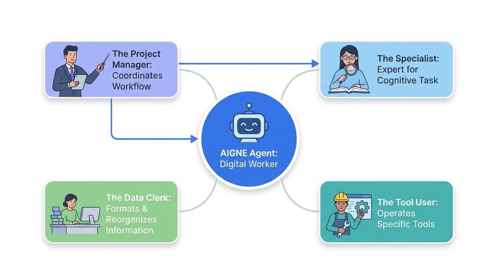

# Understanding Agents

In the AIGNE framework, an "agent" is the fundamental building block for getting work done. Think of an agent as a specialized digital worker, hired to perform a specific task. Each agent has a clear role and a set of skills. Just like in a real-world team, you can assign a single task to one agent or assemble a team of agents to tackle a more complex project.

The core principle is to break down a large problem into smaller, manageable tasks and assign each task to an agent best suited for the job. This approach allows for clarity, efficiency, and the ability to build sophisticated automated workflows.

This section provides a conceptual overview of the different roles agents can play. The following diagram illustrates a common workflow where a manager agent coordinates several specialist agents to fulfill a user's request.
<!-- DIAGRAM_IMAGE_START:intro:16:9 -->

<!-- DIAGRAM_IMAGE_END -->
For more detailed explanations, please refer to the following pages:

-   **[Basic Agents](./user-guide-understanding-agents-basic-agents.md):** Learn about individual agents as standalone workers.
-   **[Agent Teams](./user-guide-understanding-agents-agent-teams.md):** Discover how multiple agents can collaborate to solve complex problems.

### Roles Agents Can Play

To better understand their function, we can use analogies to describe the common types of agents and the roles they fulfill within the system.

<x-cards data-columns="2">
  <x-card data-title="The Specialist" data-icon="lucide:user-cog">
    This is the most common type of agent, often powered by an AI model. It's like an expert you hire for a specific cognitive task, such as a writer, translator, or analyst. You give it instructions and a piece of information, and it produces a result based on its expertise. For example, you could ask it to summarize a long article or draft a professional email.
  </x-card>
  <x-card data-title="The Project Manager" data-icon="lucide:users">
    This agent doesn't perform the tasks itself but excels at coordinating other agents. Like a real project manager, it takes a complex goal, breaks it down into smaller steps, and delegates those steps to the appropriate specialist agents. It ensures the work flows in the correct order and that the final result is assembled correctly.
  </x-card>
  <x-card data-title="The Tool User" data-icon="lucide:wrench">
    Some agents are designed to operate specific tools. This could be a calculator for performing mathematical operations, a tool that searches a database, or one that connects to an external service like a weather API. These agents are reliable and predictable, executing a precise function every time they are called.
  </x-card>
  <x-card data-title="The Data Clerk" data-icon="lucide:file-cog">
    This agent specializes in formatting and reorganizing information. It can take data in one structure and transform it into another. For instance, it could extract specific details from a customer email and format them into a structured record that can be saved in a database, much like a clerk transferring information from a paper form to a spreadsheet.
  </x-card>
</x-cards>

### Summary

By understanding agents as digital workers with specialized roles, you can begin to see how they can be combined to automate complex processes. A single agent can be a powerful tool for a specific task, but the true potential of the AIGNE framework is realized when you assemble a team of agents, each contributing its unique skills to achieve a common goal.

To learn more about how these concepts are put into practice, continue to the next sections.

-   **[Basic Agents](./user-guide-understanding-agents-basic-agents.md):** Explore how individual agents function.
-   **[Agent Teams](./user-guide-understanding-agents-agent-teams.md):** See how to orchestrate multiple agents for complex workflows.