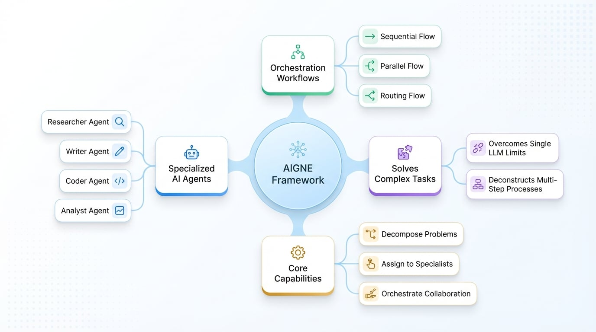

# 什么是 AIGNE？

AIGNE（发音为 `[ˈei dʒən]`，类似 "agent" 去掉 "t" 的发音）是一个用于开发 AI 应用程序的函数式框架。它旨在通过结合函数式编程、模块化设计和强大的人工智能功能，简化和加速构建可扩展的现代化应用程序的过程。

AIGNE 的核心概念是使用 **agents**——专门的 AI 助手——可以将它们组织成团队，以自动化复杂的、多步骤的任务。AIGNE 不依赖于单一、庞大的 AI，而是提供了一个创建数字劳动力的结构，其中不同的 agents 协同工作，每个 Agent 负责处理一个更大问题中的特定部分。

本文档将用通俗易懂的语言介绍 AIGNE 框架，解释什么是 AI agents，它们解决了什么问题，以及它们如何协同工作以自动化复杂的工作流。

## 什么是 AI Agent？

AI Agent 是一个专门的数字助手，旨在执行特定功能。每个 Agent 根据一组给定的指令运行，并可以配备特定的工具来执行其任务。与通用聊天机器人不同，AIGNE Agent 是一个特定领域的专家。

可以将 agents 视为一个高效项目团队中的独立成员：

*   **研究员：** 一个可以访问外部信息源以收集数据的 Agent。
*   **撰写员：** 一个处理原始信息并起草结构化文档的 Agent。
*   **编码员：** 一个能够编写和执行代码以执行技术功能的 Agent。
*   **分析员：** 一个可以解读数据、识别模式并提供见解的 Agent。

虽然单个 Agent 对于简单、明确的任务是有效的，但 AIGNE 框架的主要优势在于其能够将多个 agents 组织成一个有凝聚力的团队，以实现复杂的目标。

## AIGNE 解决的问题

单个大语言模型 (LLM) 是一个强大的工具，可用于回答问题或生成文本等任务。然而，当面临需要多个不同步骤、不同技能集或来自不同来源信息的过程时，其能力就受到了限制。

例如，像“分析我们最新的销售报告，将其与公开的竞争对手业绩数据进行比较，并为市场营销团队起草一份演示文稿”这样的请求，对于标准的聊天机器人来说是具有挑战性的。这个过程涉及几个独立的阶段：

1.  **数据分析：** 阅读和解读内部销售报告。
2.  **外部研究：** 定位并提取竞争对手的业绩数据。
3.  **综合分析：** 比较两个数据集以找出关键见解。
4.  **内容创建：** 将研究结果组织成一份连贯的演示文稿。

AIGNE 通过提供一个框架来解决这个问题，该框架可将如此复杂的请求分解为可管理的子任务。然后，每个子任务被分配给一个专门的 Agent，框架管理它们之间的信息流，确保最终输出完整准确。

## Agents 如何协同工作以实现任务自动化

AIGNE 将 agents 组织成**工作流**，这些是执行任务的结构化过程。通过连接 agents，您可以自动化那些原本需要大量手动协调的流程。该框架支持多种协作模式，从而实现灵活而强大的自动化。

下图说明了 AIGNE 框架如何分解一个复杂任务，并管理一个 agents 团队以产生最终结果。

<!-- DIAGRAM_IMAGE_START:intro:16:9 -->

<!-- DIAGRAM_IMAGE_END -->

常见的工作流模式包括：

*   **顺序工作流（流水线）：** 一个 Agent 完成其任务后，将结果直接传递给下一个 Agent。这适用于有规定操作顺序的流程，例如收集数据、进行总结，然后起草报告。
*   **并行工作流（团队协作）：** 多个 agents 同时处理任务的不同部分以提高效率。例如，在分析客户反馈时，一个 Agent 可以处理正面评价，而另一个 Agent 同时处理负面评价，最后将结果汇总。
*   **路由工作流（管理者）：** 一个“管理者” Agent 分析传入的请求，并确定哪个专家 Agent 最适合处理它。这种模式对于创建能够处理各种查询的智能助手或帮助台非常有效。

通过结合这些工作流模式，开发人员可以构建复杂的系统来自动化各种数字流程。

## 总结

AIGNE 是一个用于构建和管理由专门的 AI agents 组成的数字劳动力的框架。它提供了以下工具：

*   **分解**复杂问题为更小、定义明确的任务。
*   **分配**每个任务给具备相应技能的 AI Agent。
*   **编排** agents 之间的协作，以实现最终的、连贯的目标。

这种基于 Agent 的方法克服了单一 AI 模型的局限性，使得自动化复杂、真实的业务流程变得更加可靠和精确。

要了解更多关于 agents 在系统中所扮演的不同角色，请继续阅读下一节。

*   **下一篇：** [了解 Agents](./user-guide-understanding-agents.md)