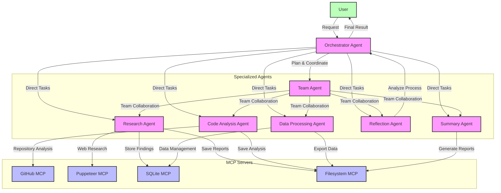
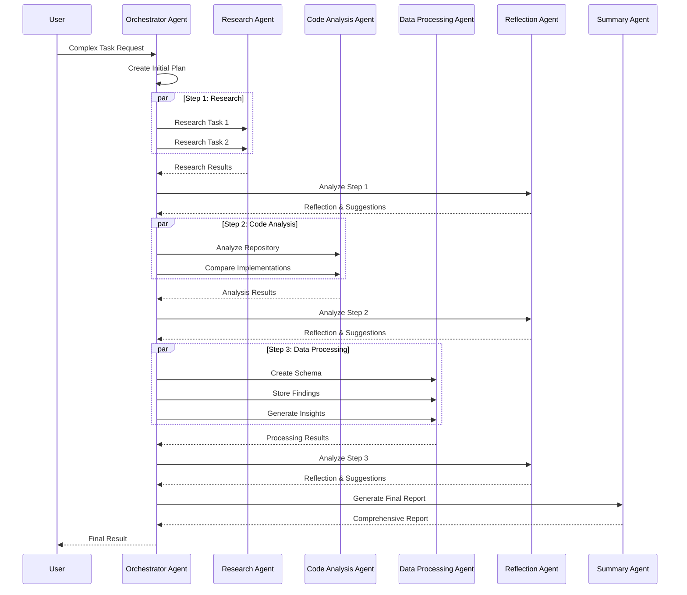

# Advanced Multi-MCP Flow Architecture

## Execution Flow

This architecture enables complex, multi-step workflows with parallel task execution, reflection-based improvements, and comprehensive result synthesis.

