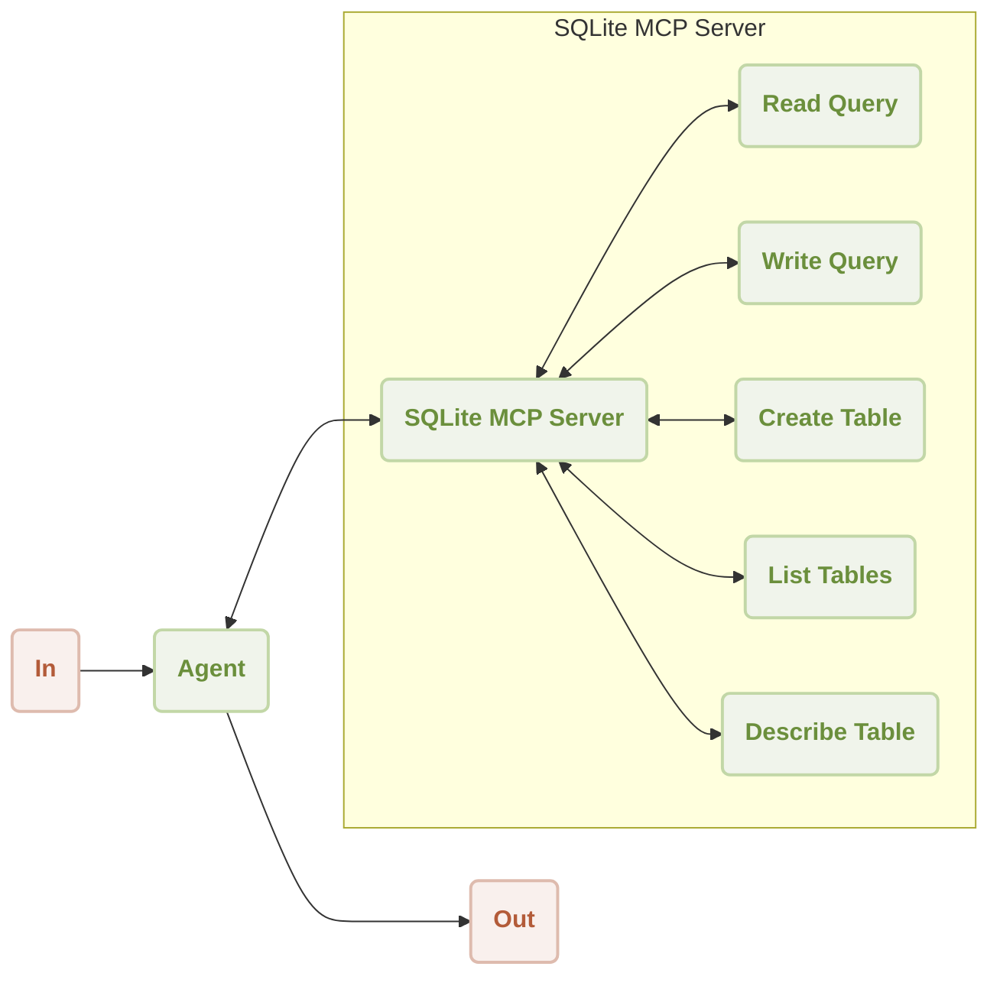
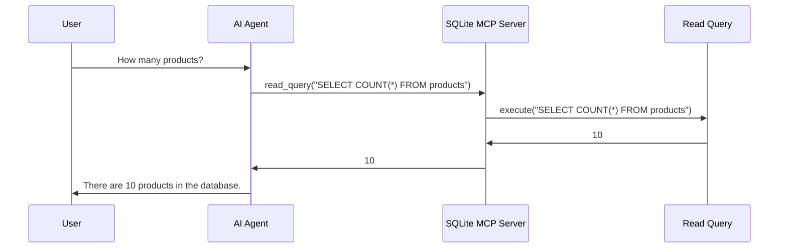

# Sqlite MCP Server Demo

<p align="center">
  <picture>
    <source srcset="https://raw.githubusercontent.com/AIGNE-io/aigne-framework/main/logo-dark.svg" media="(prefers-color-scheme: dark)">
    <source srcset="https://raw.githubusercontent.com/AIGNE-io/aigne-framework/main/logo.svg" media="(prefers-color-scheme: light)">
    
  </picture>
</p>

This is a demonstration of using [AIGNE Framework](https://github.com/AIGNE-io/aigne-framework) and [MCP Server SQlite](https://github.com/modelcontextprotocol/servers/tree/main/src/sqlite) to interact with SQLite databases. The example now supports both one-shot and interactive chat modes, along with customizable model settings and pipeline input/output.



Following is a sequence diagram of the workflow to interact with an SQLite database:



## Prerequisites

* [Node.js](https://nodejs.org) (>=20.0) and npm installed on your machine
* An [OpenAI API key](https://platform.openai.com/api-keys) for interacting with OpenAI's services
* [uv](https://github.com/astral-sh/uv) python environment for running [MCP Server SQlite](https://github.com/modelcontextprotocol/servers-archived/tree/main/src/sqlite)
* Optional dependencies (if running the example from source code):
  * [Bun](https://bun.sh) for running unit tests & examples
  * [Pnpm](https://pnpm.io) for package management

## Quick Start (No Installation Required)

### Run the Example

```bash
# Run in one-shot mode (default)
npx -y @aigne/example-mcp-sqlite

# Run in interactive chat mode
npx -y @aigne/example-mcp-sqlite --chat

# Use pipeline input
echo "create a product table with columns name description and createdAt" | npx -y @aigne/example-mcp-sqlite
```

### Connect to an AI Model

As an example, running `npx -y @aigne/example-mcp-sqlite --chat"` requires an AI model. If this is your first run, you need to connect one.


- Connect via the official AIGNE Hub

Choose the first option and your browser will open the official AIGNE Hub page. Follow the prompts to complete the connection. If you're a new user, the system automatically grants 400,000 tokens for you to use.


- Connect via a self-hosted AIGNE Hub

Choose the second option, enter the URL of your self-hosted AIGNE Hub, and follow the prompts to complete the connection. If you need to set up a self-hosted AIGNE Hub, visit the Blocklet Store to install and deploy it: [Blocklet Store](https://store.blocklet.dev/blocklets/z8ia3xzq2tMq8CRHfaXj1BTYJyYnEcHbqP8cJ?utm_source=www.arcblock.io&utm_medium=blog_link&utm_campaign=default&utm_content=store.blocklet.dev#:~:text=%F0%9F%9A%80%20Get%20Started%20in%20Minutes).


- Connect via a third-party model provider

Using OpenAI as an example, you can configure the provider's API key via environment variables. After configuration, run the example again:

```bash
export OPENAI_API_KEY="" # Set your OpenAI API key here
```
For more details on third-party model configuration (e.g., OpenAI, DeepSeek, Google Gemini), see [.env.local.example](./.env.local.example).

After configuration, run the example again.

### Debugging

The `aigne observe` command starts a local web server to monitor and analyze agent execution data. It provides a user-friendly interface to inspect traces, view detailed call information, and understand your agent’s behavior during runtime. This tool is essential for debugging, performance tuning, and gaining insight into how your agent processes information and interacts with tools and models.

Start the observation server.


View a list of recent executions.


## Installation

### Clone the Repository

```bash
git clone https://github.com/AIGNE-io/aigne-framework
```

### Install Dependencies

```bash
cd aigne-framework/examples/mcp-sqlite

pnpm install
```

### Run the Example

```bash
pnpm start # Run in one-shot mode (default)

# Run in interactive chat mode
pnpm start -- --chat

# Use pipeline input
echo "create a product table with columns name description and createdAt" | pnpm start
```

### Run Options

The example supports the following command-line parameters:

| Parameter | Description | Default |
|-----------|-------------|---------|
| `--chat` | Run in interactive chat mode | Disabled (one-shot mode) |
| `--model <provider[:model]>` | AI model to use in format 'provider\[:model]' where model is optional. Examples: 'openai' or 'openai:gpt-4o-mini' | openai |
| `--temperature <value>` | Temperature for model generation | Provider default |
| `--top-p <value>` | Top-p sampling value | Provider default |
| `--presence-penalty <value>` | Presence penalty value | Provider default |
| `--frequency-penalty <value>` | Frequency penalty value | Provider default |
| `--log-level <level>` | Set logging level (ERROR, WARN, INFO, DEBUG, TRACE) | INFO |
| `--input`, `-i <input>` | Specify input directly | None |

#### Examples

```bash
# Run in chat mode (interactive)
pnpm start -- --chat

# Set logging level
pnpm start -- --log-level DEBUG

# Use pipeline input
echo "how many products?" | pnpm start
```

## Example

The following example demonstrates how to interact with an SQLite database:

```typescript
import { join } from "node:path";
import { AIAgent, AIGNE, MCPAgent } from "@aigne/core";
import { OpenAIChatModel } from "@aigne/core/models/openai-chat-model.js";

const { OPENAI_API_KEY } = process.env;

const model = new OpenAIChatModel({
  apiKey: OPENAI_API_KEY,
});

const sqlite = await MCPAgent.from({
  command: "uvx",
  args: [
    "-q",
    "mcp-server-sqlite",
    "--db-path",
    join(process.cwd(), "usages.db"),
  ],
});

const aigne = new AIGNE({
  model,
  skills: [sqlite],
});

const agent = AIAgent.from({
  instructions: "You are a database administrator",
});

console.log(
  await aigne.invoke(
    agent,
    "create a product table with columns name description and createdAt",
  ),
);
// output:
// {
//   $message: "The product table has been created successfully with the columns: `name`, `description`, and `createdAt`.",
// }

console.log(await aigne.invoke(agent, "create 10 products for test"));
// output:
// {
//   $message: "I have successfully created 10 test products in the database. Here are the products that were added:\n\n1. Product 1: $10.99 - Description for Product 1\n2. Product 2: $15.99 - Description for Product 2\n3. Product 3: $20.99 - Description for Product 3\n4. Product 4: $25.99 - Description for Product 4\n5. Product 5: $30.99 - Description for Product 5\n6. Product 6: $35.99 - Description for Product 6\n7. Product 7: $40.99 - Description for Product 7\n8. Product 8: $45.99 - Description for Product 8\n9. Product 9: $50.99 - Description for Product 9\n10. Product 10: $55.99 - Description for Product 10\n\nIf you need any further assistance or operations, feel free to ask!",
// }

console.log(await aigne.invoke(agent, "how many products?"));
// output:
// {
//   $message: "There are 10 products in the database.",
// }

await aigne.shutdown();
```

## License

This project is licensed under the MIT License.
