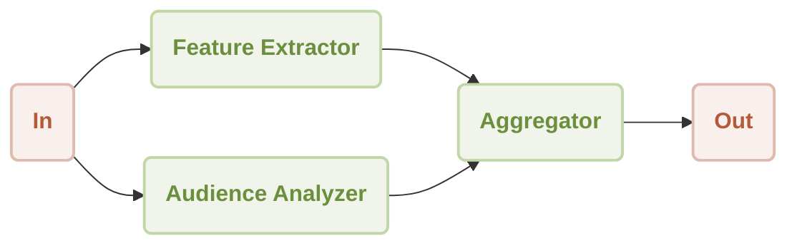

# Workflow Concurrency Demo

<p align="center">
  <picture>
    <source srcset="https://raw.githubusercontent.com/AIGNE-io/aigne-framework/main/logo-dark.svg" media="(prefers-color-scheme: dark)">
    <source srcset="https://raw.githubusercontent.com/AIGNE-io/aigne-framework/main/logo.svg" media="(prefers-color-scheme: light)">
    
  </picture>
</p>

This is a demonstration of using [AIGNE Framework](https://github.com/AIGNE-io/aigne-framework) to build a concurrency workflow. The example now supports both one-shot and interactive chat modes, along with customizable model settings and pipeline input/output.



## Prerequisites

* [Node.js](https://nodejs.org) (>=20.0) and npm installed on your machine
* An [OpenAI API key](https://platform.openai.com/api-keys) for interacting with OpenAI's services
* Optional dependencies (if running the example from source code):
  * [Bun](https://bun.sh) for running unit tests & examples
  * [Pnpm](https://pnpm.io) for package management

## Quick Start (No Installation Required)

### Run the Example

```bash
# Run in one-shot mode (default)
npx -y @aigne/example-workflow-concurrency

# Run in interactive chat mode
npx -y @aigne/example-workflow-concurrency --chat

# Use pipeline input
echo "Analyze product: Smart home assistant with voice control and AI learning capabilities" | npx -y @aigne/example-workflow-concurrency
```

### Connect to an AI Model

As an example, running `npx -y @aigne/example-workflow-concurrency --chat` requires an AI model. If this is your first run, you need to connect one.


- Connect via the official AIGNE Hub

Choose the first option and your browser will open the official AIGNE Hub page. Follow the prompts to complete the connection. If you're a new user, the system automatically grants 400,000 tokens for you to use.


- Connect via a self-hosted AIGNE Hub

Choose the second option, enter the URL of your self-hosted AIGNE Hub, and follow the prompts to complete the connection. If you need to set up a self-hosted AIGNE Hub, visit the Blocklet Store to install and deploy it: [Blocklet Store](https://store.blocklet.dev/blocklets/z8ia3xzq2tMq8CRHfaXj1BTYJyYnEcHbqP8cJ?utm_source=www.arcblock.io&utm_medium=blog_link&utm_campaign=default&utm_content=store.blocklet.dev#:~:text=%F0%9F%9A%80%20Get%20Started%20in%20Minutes).


- Connect via a third-party model provider

Using OpenAI as an example, you can configure the provider's API key via environment variables. After configuration, run the example again:

```bash
export OPENAI_API_KEY="" # Set your OpenAI API key here
```
For more details on third-party model configuration (e.g., OpenAI, DeepSeek, Google Gemini), see [.env.local.example](./.env.local.example).

After configuration, run the example again.

### Debugging

The `aigne observe` command starts a local web server to monitor and analyze agent execution data. It provides a user-friendly interface to inspect traces, view detailed call information, and understand your agent’s behavior during runtime. This tool is essential for debugging, performance tuning, and gaining insight into how your agent processes information and interacts with tools and models.

Start the observation server.


View a list of recent executions.


## Installation

### Clone the Repository

```bash
git clone https://github.com/AIGNE-io/aigne-framework
```

### Install Dependencies

```bash
cd aigne-framework/examples/workflow-concurrency

pnpm install
```

### Run the Example

```bash
pnpm start # Run in one-shot mode (default)

# Run in interactive chat mode
pnpm start -- --chat

# Use pipeline input
echo "Analyze product: Smart home assistant with voice control and AI learning capabilities" | pnpm start
```

### Run Options

The example supports the following command-line parameters:

| Parameter | Description | Default |
|-----------|-------------|---------|
| `--chat` | Run in interactive chat mode | Disabled (one-shot mode) |
| `--model <provider[:model]>` | AI model to use in format 'provider\[:model]' where model is optional. Examples: 'openai' or 'openai:gpt-4o-mini' | openai |
| `--temperature <value>` | Temperature for model generation | Provider default |
| `--top-p <value>` | Top-p sampling value | Provider default |
| `--presence-penalty <value>` | Presence penalty value | Provider default |
| `--frequency-penalty <value>` | Frequency penalty value | Provider default |
| `--log-level <level>` | Set logging level (ERROR, WARN, INFO, DEBUG, TRACE) | INFO |
| `--input`, `-i <input>` | Specify input directly | None |

#### Examples

```bash
# Run in chat mode (interactive)
pnpm start -- --chat

# Set logging level
pnpm start -- --log-level DEBUG

# Use pipeline input
echo "Analyze product: Smart home assistant with voice control and AI learning capabilities" | pnpm start
```

## Example

The following example demonstrates how to build a concurrency workflow:

```typescript
import { AIAgent, AIGNE, ProcessMode, TeamAgent } from "@aigne/core";
import { OpenAIChatModel } from "@aigne/core/models/openai-chat-model.js";

const { OPENAI_API_KEY } = process.env;

const model = new OpenAIChatModel({
  apiKey: OPENAI_API_KEY,
});

const featureExtractor = AIAgent.from({
  instructions: `\
You are a product analyst. Extract and summarize the key features of the product.

Product description:
{{product}}`,
  outputKey: "features",
});

const audienceAnalyzer = AIAgent.from({
  instructions: `\
You are a market researcher. Identify the target audience for the product.

Product description:
{{product}}`,
  outputKey: "audience",
});

const aigne = new AIGNE({ model });

// 创建一个 TeamAgent 来处理并行工作流
const teamAgent = TeamAgent.from({
  skills: [featureExtractor, audienceAnalyzer],
  mode: ProcessMode.parallel,
});

const result = await aigne.invoke(teamAgent, {
  product: "AIGNE is a No-code Generative AI Apps Engine",
});

console.log(result);

// Output:
// {
//   features: "**Product Name:** AIGNE\n\n**Product Type:** No-code Generative AI Apps Engine\n\n...",
//   audience: "**Small to Medium Enterprises (SMEs)**: \n   - Businesses that may not have extensive IT resources or budget for app development but are looking to leverage AI to enhance their operations or customer engagement.\n\n...",
// }
```

## License

This project is licensed under the MIT License.
