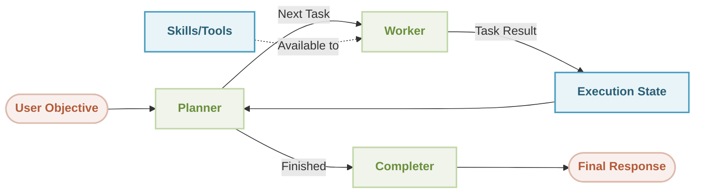

# Workflow Orchestrator Demo

<p align="center">
  <picture>
    <source srcset="https://raw.githubusercontent.com/AIGNE-io/aigne-framework/main/logo-dark.svg" media="(prefers-color-scheme: dark)">
    <source srcset="https://raw.githubusercontent.com/AIGNE-io/aigne-framework/main/logo.svg" media="(prefers-color-scheme: light)">
    
  </picture>
</p>

This is a demonstration of using [AIGNE Framework](https://github.com/AIGNE-io/aigne-framework) to build an orchestrator workflow using YAML configuration. The orchestrator pattern enables autonomous task planning and execution through a planner-worker-completer architecture.

## 💡 Key Concept

**The orchestrator uses your current directory as its workspace.** When you run the orchestrator in any directory, it can access and analyze files in that location. This makes it perfect for:

- 📊 **Project Analysis**: Analyze any codebase by running it in the project root
- 🔍 **Code Auditing**: Review project structure, dependencies, and configurations
- 📝 **Documentation Generation**: Automatically generate documentation based on actual code
- 🛠️ **Workspace Automation**: Perform complex multi-step operations on your files

> **Example**: Running `npx -y @aigne/example-workflow-orchestrator` in your project directory will analyze that specific project, not a fixed demo directory.

## Architecture

The orchestrator follows a three-phase workflow:



**Components:**
- **Planner**: Analyzes the objective and execution state to determine the next task
- **Worker**: Executes assigned tasks using available skills and tools
- **Completer**: Synthesizes all results and provides the final response
- **Execution State**: Tracks task history, results, and progress

## How It Works

When you run the orchestrator in a directory:

1. **Directory Mounting**: Your current directory is automatically mounted as `/modules/workspace/`
2. **Planning Phase**: The Planner analyzes your objective and decides what information to gather
3. **Execution Phase**: The Worker uses filesystem tools to read files, explore directories, etc.
4. **Iteration**: Steps 2-3 repeat until the objective is complete
5. **Completion**: The Completer synthesizes all gathered information into a final response

**Example Workflow**:
```
User runs: npx -y @aigne/example-workflow-orchestrator
Current directory: /home/user/my-project/

→ Planner: "Need to explore project structure"
→ Worker: Lists files in /modules/workspace/ (maps to /home/user/my-project/)
→ Planner: "Need to read package.json"
→ Worker: Reads /modules/workspace/package.json
→ Planner: "Have enough information, generate report"
→ Completer: Creates final project summary
```

## Prerequisites

* [Node.js](https://nodejs.org) (>=20.0) and npm installed on your machine
* An [OpenAI API key](https://platform.openai.com/api-keys) for interacting with OpenAI's services
* Optional dependencies (if running the example from source code):
  * [Bun](https://bun.sh) for running unit tests & examples
  * [Pnpm](https://pnpm.io) for package management

## Quick Start

The orchestrator is configured using YAML files. This example uses:
- [aigne.yaml](./aigne.yaml) - Main configuration file
- [agents/orchestrator.yaml](./agents/orchestrator.yaml) - Orchestrator agent definition
- [agents/objective.md](./agents/objective.md) - Objective prompt template
- [agents/planner.md](./agents/planner.md) - Custom planner instructions

### Run with npx (No Installation Required)

**Important**: The orchestrator will analyze the directory where you run it. Navigate to your target project first:

```bash
# Navigate to your project directory
cd /path/to/your/project

# Run the orchestrator - it will analyze the current directory
npx -y @aigne/example-workflow-orchestrator

# Run with chat mode for interactive instructions
npx -y @aigne/example-workflow-orchestrator --interactive

# Run with custom message
npx -y @aigne/example-workflow-orchestrator --message "Analyze the project dependencies and security issues"
```

**What happens**: The orchestrator mounts your current directory as `/modules/workspace/` and can read, analyze, and work with all files in that location.

### Test Cases

#### 1. Basic Analysis (2-3 steps)
Run the orchestrator in a simple project directory to generate a summary report.

```bash
cd /path/to/simple-project
npx -y @aigne/example-workflow-orchestrator --message "Generate a project summary report"
```

**What this tests**: Basic file exploration and information extraction

---

#### 2. Security Audit (5-8 steps)
Run the orchestrator in a codebase to identify potential security issues.

```bash
cd /path/to/codebase
npx -y @aigne/example-workflow-orchestrator --message "Perform a security audit: check for outdated dependencies, exposed secrets, insecure configurations, missing security headers, and vulnerable code patterns. Provide a risk-rated report"
```

**What this tests**: Multi-dimensional analysis and risk assessment

---

#### 3. Code Review (4-6 steps)
Run the orchestrator to review code quality and suggest improvements.

```bash
cd /path/to/codebase
npx -y @aigne/example-workflow-orchestrator --message "Review the code quality: identify code smells, adherence to best practices, and suggest improvements. Provide a summary report"
```

**What this tests**: Code quality analysis and pattern recognition

---

#### 4. Documentation Suite Generation ⭐ (12-15 steps)
**Advanced test case**: Analyze repository and create comprehensive, well-organized documentation.

```bash
cd /path/to/any/project
npx -y @aigne/example-workflow-orchestrator --message "Analyze this repository and create a comprehensive documentation suite in the docs/ directory. Include: 1) Architecture overview, 2) Getting started guide, 3) API reference, 4) Contributing guidelines, 5) Component/module documentation. Organize the docs logically with a clear navigation structure."
```

**What this tests**:
- Multi-file creation workflow
- Comprehensive analysis and synthesis
- Structured output generation
- File system write operations
- Logical organization and planning

### Connect to an AI Model

As an example, running `npx -y @aigne/example-workflow-orchestrator --interactive` requires an AI model. If this is your first run, you need to connect one.


- Connect via the official AIGNE Hub

Choose the first option and your browser will open the official AIGNE Hub page. Follow the prompts to complete the connection. If you're a new user, the system automatically grants 400,000 tokens for you to use.


- Connect via a self-hosted AIGNE Hub

Choose the second option, enter the URL of your self-hosted AIGNE Hub, and follow the prompts to complete the connection. If you need to set up a self-hosted AIGNE Hub, visit the Blocklet Store to install and deploy it: [Blocklet Store](https://store.blocklet.dev/blocklets/z8ia3xzq2tMq8CRHfaXj1BTYJyYnEcHbqP8cJ?utm_source=www.arcblock.io&utm_medium=blog_link&utm_campaign=default&utm_content=store.blocklet.dev#:~:text=%F0%9F%9A%80%20Get%20Started%20in%20Minutes).


- Connect via a third-party model provider

Using OpenAI as an example, you can configure the provider's API key via environment variables. After configuration, run the example again:

```bash
export OPENAI_API_KEY="" # Set your OpenAI API key here
```
For more details on third-party model configuration (e.g., OpenAI, DeepSeek, Google Gemini), see [.env.local.example](./.env.local.example).

After configuration, run the example again.

### Debugging

The `aigne observe` command starts a local web server to monitor and analyze agent execution data. It provides a user-friendly interface to inspect traces, view detailed call information, and understand your agent’s behavior during runtime. This tool is essential for debugging, performance tuning, and gaining insight into how your agent processes information and interacts with tools and models.

Start the observation server.


View a list of recent executions.


## Installation

### Clone the Repository

```bash
git clone https://github.com/AIGNE-io/aigne-framework
```

### Install Dependencies

```bash
cd aigne-framework/examples/workflow-orchestrator

pnpm install
```

### Setup Environment Variables

Setup your OpenAI API key in the `.env.local` file:

```bash
OPENAI_API_KEY="" # Set your OpenAI API key here
```

When running Puppeteer inside a Docker container, set the following environment variable:

```
DOCKER_CONTAINER="true"
```

This ensures Puppeteer configures itself correctly for a Docker environment, preventing potential compatibility issues.

#### Using Different Models

You can use different AI models by setting the `MODEL` environment variable along with the corresponding API key. The framework supports multiple providers:

* **OpenAI**: `MODEL="openai:gpt-4.1"` with `OPENAI_API_KEY`
* **Anthropic**: `MODEL="anthropic:claude-3-7-sonnet-latest"` with `ANTHROPIC_API_KEY`
* **Google Gemini**: `MODEL="gemini:gemini-2.0-flash"` with `GEMINI_API_KEY`
* **AWS Bedrock**: `MODEL="bedrock:us.amazon.nova-premier-v1:0"` with AWS credentials
* **DeepSeek**: `MODEL="deepseek:deepseek-chat"` with `DEEPSEEK_API_KEY`
* **OpenRouter**: `MODEL="openrouter:openai/gpt-4o"` with `OPEN_ROUTER_API_KEY`
* **xAI**: `MODEL="xai:grok-2-latest"` with `XAI_API_KEY`
* **Ollama**: `MODEL="ollama:llama3.2"` with `OLLAMA_DEFAULT_BASE_URL`

For detailed configuration examples, please refer to the `.env.local.example` file in this directory.

### Run from Source

```bash
cd examples/workflow-orchestrator
pnpm start
```

You can pass custom messages to the orchestrator:

```bash
# Pass message via command line
pnpm start --message "Analyze the project structure"

# Or use YAML input
pnpm start --input-yaml '{ message: "Generate a README for this project" }'
```

## Configuration

### Main Configuration (aigne.yaml)

```yaml
#!/usr/bin/env aigne

model: aignehub/google/gemini-2.5-pro
agents:
  - agents/orchestrator.yaml
```

### Orchestrator Configuration (agents/orchestrator.yaml)

```yaml
type: "@aigne/agent-library/orchestrator"
name: orchestrator
input_schema:
  type: object
  properties:
    message:
      type: string
      description: (Optional) User's instruction
  required: []

# Specify the objective for the orchestrator agent
objective:
  url: objective.md

# Custom planner agent can be defined here
planner:
  type: ai
  instructions:
    url: planner.md

# Custom worker agent (optional)
# worker:
#   type: ai
#   instructions:
#     url: path/to/worker_instructions.md

# Custom completer agent (optional)
# completer:
#   type: ai
#   instructions:
#     url: path/to/completer_instructions.md

# State management configuration
state_management:
  max_iterations: 5              # Maximum planning-execution iterations
  max_tokens: 100000            # Optional: limit total tokens for state management
  keep_recent: 20               # Optional: keep only N most recent states in memory

# Agent File System (AFS) configuration - Critical for accessing files
afs:
  modules:
    - module: history      # Enables access to conversation history
    - module: local-fs     # Mounts local filesystem
      options:
        name: workspace    # Mounted as /modules/workspace/
        localPath: .       # Current directory (where you run the command)
        description: Workspace directory for the orchestrator agent.
```

### Objective Template (agents/objective.md)

```markdown

{{ message }}

Explore the workspace structure and generate a project summary report in Markdown format.

```

When you run without the `--message` flag, it uses the default objective. With `--message`, your custom message replaces the entire objective.

### Custom Planner Instructions (agents/planner.md)

The planner is responsible for iterative task planning. See [agents/planner.md](./agents/planner.md) for the full custom planner prompt that enables autonomous exploration and task decomposition.

### Key Features

1. **Current Directory as Workspace**: Automatically mounts your current directory for file access
2. **YAML-based Configuration**: Define your orchestrator workflow declaratively
3. **Customizable Components**: Override planner, worker, or completer with custom instructions
4. **State Management**: Control iteration limits and memory usage
5. **Agent File System**: Shared storage accessible to all agent components
6. **Template Support**: Use Jinja2-style templates in objective prompts

## License

This project is licensed under the MIT License.
