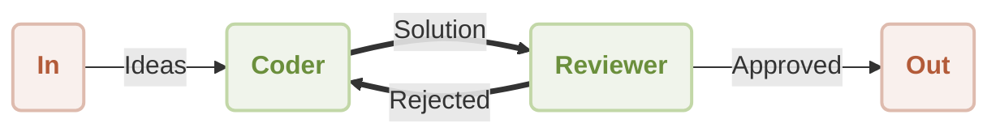

# Workflow Reflection Demo

<p align="center">
  <picture>
    <source srcset="https://raw.githubusercontent.com/AIGNE-io/aigne-framework/main/logo-dark.svg" media="(prefers-color-scheme: dark)">
    <source srcset="https://raw.githubusercontent.com/AIGNE-io/aigne-framework/main/logo.svg" media="(prefers-color-scheme: light)">
    
  </picture>
</p>

This is a demonstration of using [AIGNE Framework](https://github.com/AIGNE-io/aigne-framework) to build a reflection workflow. The example now supports both one-shot and interactive chat modes, along with customizable model settings and pipeline input/output.



## Prerequisites

* [Node.js](https://nodejs.org) (>=20.0) and npm installed on your machine
* An [OpenAI API key](https://platform.openai.com/api-keys) for interacting with OpenAI's services
* Optional dependencies (if running the example from source code):
  * [Bun](https://bun.sh) for running unit tests & examples
  * [Pnpm](https://pnpm.io) for package management

## Quick Start (No Installation Required)

### Run the Example

```bash
# Run in one-shot mode (default)
npx -y @aigne/example-workflow-reflection

# Run in interactive chat mode
npx -y @aigne/example-workflow-reflection --interactive

# Use pipeline input
echo "Write a function to validate email addresses" | npx -y @aigne/example-workflow-reflection
```

### Connect to an AI Model

As an example, running `npx -y @aigne/example-workflow-reflection --interactive` requires an AI model. If this is your first run, you need to connect one.


- Connect via the official AIGNE Hub

Choose the first option and your browser will open the official AIGNE Hub page. Follow the prompts to complete the connection. If you're a new user, the system automatically grants 400,000 tokens for you to use.


- Connect via a self-hosted AIGNE Hub

Choose the second option, enter the URL of your self-hosted AIGNE Hub, and follow the prompts to complete the connection. If you need to set up a self-hosted AIGNE Hub, visit the Blocklet Store to install and deploy it: [Blocklet Store](https://store.blocklet.dev/blocklets/z8ia3xzq2tMq8CRHfaXj1BTYJyYnEcHbqP8cJ?utm_source=www.arcblock.io&utm_medium=blog_link&utm_campaign=default&utm_content=store.blocklet.dev#:~:text=%F0%9F%9A%80%20Get%20Started%20in%20Minutes).


- Connect via a third-party model provider

Using OpenAI as an example, you can configure the provider's API key via environment variables. After configuration, run the example again:

```bash
export OPENAI_API_KEY="" # Set your OpenAI API key here
```
For more details on third-party model configuration (e.g., OpenAI, DeepSeek, Google Gemini), see [.env.local.example](./.env.local.example).

After configuration, run the example again.

### Debugging

The `aigne observe` command starts a local web server to monitor and analyze agent execution data. It provides a user-friendly interface to inspect traces, view detailed call information, and understand your agent’s behavior during runtime. This tool is essential for debugging, performance tuning, and gaining insight into how your agent processes information and interacts with tools and models.

Start the observation server.


View a list of recent executions.


## Installation

### Clone the Repository

```bash
git clone https://github.com/AIGNE-io/aigne-framework
```

### Install Dependencies

```bash
cd aigne-framework/examples/workflow-reflection

pnpm install
```

### Run the Example

```bash
pnpm start # Run in one-shot mode (default)

# Run in interactive chat mode
pnpm start -- --interactive

# Use pipeline input
echo "Write a function to validate email addresses" | pnpm start
```

### Run Options

The example supports the following command-line parameters:

| Parameter | Description | Default |
|-----------|-------------|---------|
| `--interactive` | Run in interactive chat mode | Disabled (one-shot mode) |
| `--model <provider[:model]>` | AI model to use in format 'provider\[:model]' where model is optional. Examples: 'openai' or 'openai:gpt-4o-mini' | openai |
| `--temperature <value>` | Temperature for model generation | Provider default |
| `--top-p <value>` | Top-p sampling value | Provider default |
| `--presence-penalty <value>` | Presence penalty value | Provider default |
| `--frequency-penalty <value>` | Frequency penalty value | Provider default |
| `--log-level <level>` | Set logging level (ERROR, WARN, INFO, DEBUG, TRACE) | INFO |
| `--input`, `-i <input>` | Specify input directly | None |

#### Examples

```bash
# Run in chat mode (interactive)
pnpm start -- --interactive

# Set logging level
pnpm start -- --log-level DEBUG

# Use pipeline input
echo "Write a function to validate email addresses" | pnpm start
```

## Example

The following example demonstrates how to build a reflection workflow:

```typescript
import { AIAgent, AIGNE, UserInputTopic, UserOutputTopic } from "@aigne/core";
import { OpenAIChatModel } from "@aigne/core/models/openai-chat-model.js";
import { z } from "zod";

const { OPENAI_API_KEY } = process.env;

const model = new OpenAIChatModel({
  apiKey: OPENAI_API_KEY,
});

const coder = AIAgent.from({
  subscribeTopic: [UserInputTopic, "rewrite_request"],
  publishTopic: "review_request",
  instructions: `\
You are a proficient coder. You write code to solve problems.
Work with the reviewer to improve your code.
Always put all finished code in a single Markdown code block.
For example:
\`\`\`python
def hello_world():
    print("Hello, World!")
\`\`\`

Respond using the following format:

Thoughts: <Your comments>
Code: <Your code>

Previous review result:
{{feedback}}

User's question:
{{question}}
`,
  outputSchema: z.object({
    code: z.string().describe("Your code"),
  }),
});

const reviewer = AIAgent.from({
  subscribeTopic: "review_request",
  publishTopic: (output) =>
    output.approval ? UserOutputTopic : "rewrite_request",
  instructions: `\
You are a code reviewer. You focus on correctness, efficiency and safety of the code.

The problem statement is: {{question}}
The code is:
\`\`\`
{{code}}
\`\`\`

Previous feedback:
{{feedback}}

Please review the code. If previous feedback was provided, see if it was addressed.
`,
  outputSchema: z.object({
    approval: z.boolean().describe("APPROVE or REVISE"),
    feedback: z.object({
      correctness: z.string().describe("Your comments on correctness"),
      efficiency: z.string().describe("Your comments on efficiency"),
      safety: z.string().describe("Your comments on safety"),
      suggested_changes: z
        .string()
        .describe("Your comments on suggested changes"),
    }),
  }),
  includeInputInOutput: true,
});

const aigne = new AIGNE({ model, agents: [coder, reviewer] });
aigne.publish(
  UserInputTopic,
  "Write a function to find the sum of all even numbers in a list.",
);

const { message } = await aigne.subscribe(UserOutputTopic);
console.log(message);
// Output:
// {
//   code: "def sum_of_even_numbers(numbers):\n    \"\"\"Function to calculate the sum of all even numbers in a list.\"\"\"\n    return sum(number for number in numbers if number % 2 == 0)",
//   approval: true,
//   feedback: {
//     correctness: "The function correctly calculates the sum of all even numbers in the given list. It properly checks for evenness using the modulus operator and sums the valid numbers.",
//     efficiency: "The implementation is efficient as it uses a generator expression which computes the sum in a single pass over the list. This minimizes memory usage as compared to creating an intermediate list of even numbers.",
//     safety: "The function does not contain any safety issues. However, it assumes that all elements in the input list are integers. It would be prudent to handle cases where the input contains non-integer values (e.g., None, strings, etc.).",
//     suggested_changes: "Consider adding type annotations to the function for better clarity and potential type checking, e.g. `def sum_of_even_numbers(numbers: list[int]) -> int:`. Also, include input validation to ensure 'numbers' is a list of integers.",
//   },
// }
```

## License

This project is licensed under the MIT License.
