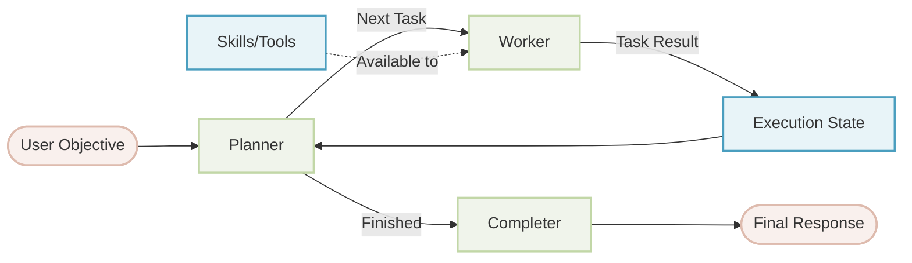
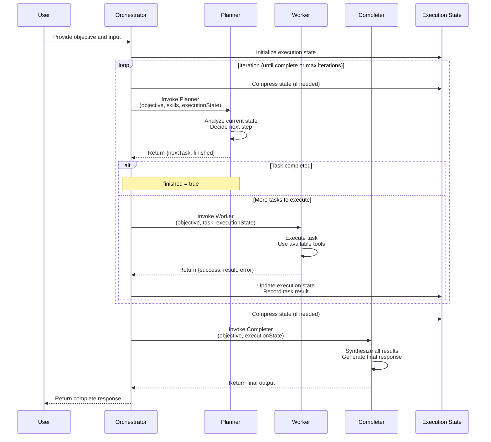

# Orchestrator Agent

[中文版](README.zh.md) | English

The Orchestrator Agent is a sophisticated agent pattern that enables autonomous task planning and execution through a three-phase architecture: **Planner → Worker → Completer**. It breaks down complex objectives into manageable tasks, executes them iteratively, and synthesizes the final results.

## Table of Contents

- [Architecture Overview](#architecture-overview)
- [Core Concepts](#core-concepts)
- [Usage](#usage)
  - [Basic Usage with YAML](#basic-usage-with-yaml)
  - [Custom Components](#custom-components)
- [Configuration Reference](#configuration-reference)
- [Advanced Features](#advanced-features)
- [Examples](#examples)
- [Best Practices](#best-practices)

## Architecture Overview



### Components

1. **Planner**: Analyzes the objective and current execution state to determine the next task to execute
2. **Worker**: Executes the assigned task using available skills and tools
3. **Completer**: Synthesizes all task results into a final, comprehensive response
4. **Execution State**: Tracks task history, results, and status throughout the workflow

### Workflow Sequence Diagram



**Key Process Steps:**

1. **Initialization**: Orchestrator receives user input and initializes execution state
2. **Iteration Loop**:
   - State Compression: Limits execution state size based on configuration
   - Planning Phase: Planner decides the next task based on current state
   - Execution Phase: Worker executes the task and returns results
   - State Update: Task results are recorded in the execution state
3. **Completion Phase**: Completer synthesizes all task results into the final response

## Core Concepts

### Execution Flow

The orchestrator operates in an iterative loop:

1. **Planning Phase**: The planner reviews the objective and execution state, decides the next task
2. **Execution Phase**: The worker executes the task and returns results
3. **State Update**: Task results are added to the execution state
4. **Repeat**: Steps 1-3 continue until the planner marks the objective as complete
5. **Completion Phase**: The completer synthesizes all results into the final response

### Task Record Structure

Each executed task is tracked with the following information:

```typescript
interface TaskRecord {
  task: string;              // Task description
  status: 'pending' | 'completed' | 'failed';
  result?: unknown;          // Task execution result
  error?: {                  // Error info if task failed
    message: string;
  };
  createdAt?: number;        // Timestamp when task was created
  completedAt?: number;      // Timestamp when task completed
}
```

### Execution State

The execution state maintains a history of all tasks:

```typescript
interface ExecutionState {
  tasks: TaskRecord[];
}
```

## Usage

### Basic Usage with YAML

The simplest way to use the Orchestrator is through YAML configuration:

**orchestrator.yaml**
```yaml
type: "@aigne/agent-library/orchestrator"
name: orchestrator

# Optional: Define custom input fields
# Any field you want to use in objective templates must be declared here
input_schema:
  type: object
  properties:
    message:
      type: string
      description: User's custom instruction
  required: []

# Define the overall objective
objective:
  url: objective.md

# Optional: customize state management
state_management:
  max_iterations: 20        # Maximum planning-execution cycles
  max_tokens: 100000       # Token limit for execution state
  keep_recent: 20          # Keep only N most recent tasks

# Optional: configure Agent File System
afs:
  modules:
    - module: local-fs
      options:
        name: workspace
        localPath: .
        description: Workspace directory for the orchestrator agent
```

**objective.md**
```markdown
Analyze the project structure and generate a comprehensive report.

- Ignore node_modules, .git, dist, build directories
- Provide accurate information based on actual file contents
- Include key findings and recommendations


## User Instructions
{{ message }}

```

**aigne.yaml**
```yaml
#!/usr/bin/env aigne

model: google/gemini-2.5-pro
agents:
  - agents/orchestrator.yaml
```

### Custom Components

You can customize any of the three core components (planner, worker, completer). Each component has standard input/output parameters that should be used appropriately in custom implementations.

#### Custom Planner

**Standard Input Parameters:**
- `objective` (string): The user's overall objective
- `skills` (array): List of available skills
- `executionState` (object): Current execution state containing history of all executed tasks

**Standard Output Parameters:**
- `nextTask` (string, optional): Description of the next task to execute
- `finished` (boolean, optional): Whether all tasks are completed

**orchestrator.yaml**
```yaml
type: "@aigne/agent-library/orchestrator"
objective:
  url: objective.md

planner:
  type: ai
  instructions:
    url: custom-planner.md
```

**custom-planner.md**
```markdown
## Your Role
You are a strategic planner for code analysis tasks.

## Objective
{{ objective }}

## Available Skills
{{ skills | yaml.stringify }}

## Current Execution State
{{ executionState | yaml.stringify }}

## Planning Guidelines
- Prioritize high-impact areas first
- Group related analysis tasks together
- Consider dependencies between tasks
- Review completed tasks in executionState to avoid duplicate work
- Plan tasks based on available skills
- Set finished: true when analysis is complete

## Output Format
Return an object with the following fields:
- `nextTask`: Description of the next task to execute (omit if finished)
- `finished`: Boolean indicating completion status
```

#### Custom Worker

**Standard Input Parameters:**
- `objective` (string): The user's overall objective (for context only)
- `task` (string): The specific task to execute
- `executionState` (object): Current execution state, useful for understanding previous task results

**Standard Output Parameters:**
- `result` (string, optional): Task execution result
- `success` (boolean): Whether the task completed successfully
- `error` (object, optional): Error information containing `message` field

**orchestrator.yaml**
```yaml
worker:
  type: ai
  instructions:
    url: custom-worker.md
```

**custom-worker.md**
```markdown
## Your Role
You are a professional code analysis worker.

## Overall Objective (For Context Only)
{{ objective }}

**Important**: The overall objective is only for understanding context. You only need to execute the specific task assigned below.

## Current Task
{{ task }}

## Execution State
{{ executionState | yaml.stringify }}

## Execution Guidelines
- Focus on completing the current task only, don't try to complete the entire objective
- You can reference results from previous tasks in executionState
- Use available tools and skills to complete the task
- If the task cannot be completed, explain the reason in error

## Output Format
Return an object with the following fields:
- `success`: Boolean indicating whether the task succeeded
- `result`: String describing the task execution result (required if successful)
- `error`: Object containing `message` field (required if failed)
```

#### Custom Completer

**Standard Input Parameters:**
- `objective` (string): The user's overall objective
- `executionState` (object): Complete execution state containing all executed tasks

**Standard Output Parameters:**
Customized by user through `output_schema`, can be any structure

**orchestrator.yaml**
```yaml
completer:
  type: ai
  instructions:
    url: custom-completer.md
  output_schema:
    type: object
    properties:
      summary:
        type: string
        description: Executive summary
      details:
        type: object
        description: Detailed findings
      recommendations:
        type: array
        items:
          type: string
        description: Action recommendations
    required: [summary]
```

**custom-completer.md**
```markdown
## Your Role
You are responsible for synthesizing all task results and generating the final response.

## User Objective
{{ objective }}

## Execution Results
{{ executionState | yaml.stringify }}

## Synthesis Guidelines
- Analyze all task results in executionState
- Distinguish between successful and failed tasks
- Integrate scattered results into a coherent response
- Organize content according to the output schema structure

## Output Format
Return an object conforming to the defined output_schema, containing:
- `summary`: Executive summary
- `details`: Detailed findings
- `recommendations`: List of action recommendations
```

## Configuration Reference

### OrchestratorAgentOptions

| Option | Type | Required | Description |
|--------|------|----------|-------------|
| `objective` | `PromptBuilder` | Yes | The overall objective for the orchestrator |
| `planner` | `Agent` | No | Custom planner agent (uses default if not provided) |
| `worker` | `Agent` | No | Custom worker agent (uses default if not provided) |
| `completer` | `Agent` | No | Custom completer agent (uses default if not provided) |
| `stateManagement` | `StateManagementOptions` | No | Configuration for managing execution state |
| `inputSchema` | `ZodSchema` | No | Schema for input validation |
| `outputSchema` | `ZodSchema` | No | Schema for output validation |
| `afs` | `AFSOptions` | No | Agent File System configuration |
| `skills` | `Agent[]` | No | Tools/skills available to worker |
| `model` | `string` | No | Default model for all components |

> **Important**: When using custom input fields in your `objective` template (e.g., `{{ topic }}`, `{{ message }}`), you must declare these fields in the `inputSchema`. Any undeclared field will not be available in the template context.

### StateManagementOptions

| Option | Type | Default | Description |
|--------|------|---------|-------------|
| `maxIterations` | `number` | 20 | Maximum number of planning-execution cycles |
| `maxTokens` | `number` | - | Maximum tokens allowed for execution state |
| `keepRecent` | `number` | - | Number of recent tasks to keep when compressing state |

### State Compression

To prevent context overflow during long-running executions, the orchestrator can compress the execution state:

1. **keepRecent**: Keeps only the N most recent tasks
2. **maxTokens**: Applies token limit, keeping most recent tasks that fit
3. Both options work together: `keepRecent` is applied first, then `maxTokens`

```yaml
state_management:
  max_iterations: 50       # Allow many iterations
  max_tokens: 80000       # But limit context size
  keep_recent: 30         # Keep up to 30 recent tasks (if they fit in token limit)
```

## Advanced Features

### Sharing Context with Agent File System

The orchestrator and all its components share access to the Agent File System:

```yaml
afs:
  modules:
    - module: local-fs
      options:
        name: workspace
        localPath: .
    - module: local-fs
      options:
        name: output
        localPath: ./output
```

All components (planner, worker, completer) can read/write files through AFS.

### Error Handling

The orchestrator gracefully handles task failures. When a task fails, it's recorded in the execution state with error information:

```yaml
task: "Read non-existent file"
status: "failed"
error:
  message: "File not found: /path/to/missing.txt"
```

The planner receives failure information and can:
- Retry with a different approach
- Skip the task and continue
- Mark the objective as completed despite the failure

### Iteration Control

You can control the maximum number of planning-execution cycles:

```yaml
state_management:
  max_iterations: 30  # Allow up to 30 planning-execution cycles
```

When `maxIterations` is reached, the orchestrator stops and invokes the completer with available results.

## Examples

### Example 1: Project Documentation Generator

Generate comprehensive documentation by exploring a project:

**orchestrator.yaml**
```yaml
type: "@aigne/agent-library/orchestrator"
objective: |
  Explore the codebase and generate comprehensive documentation including:
  - Project overview and architecture
  - API reference
  - Setup instructions
  - Usage examples

state_management:
  max_iterations: 15

afs:
  modules:
    - module: local-fs
      options:
        name: source
        localPath: ./src
    - module: local-fs
      options:
        name: docs
        localPath: ./docs
```

### Example 2: Research and Report Generation

Conduct research and generate a structured report:

```yaml
type: "@aigne/agent-library/orchestrator"
name: researcher

# IMPORTANT: Declare custom input fields
input_schema:
  type: object
  properties:
    topic:
      type: string
      description: Research topic
    depth:
      type: string
      enum: [basic, detailed, comprehensive]
      description: Research depth
  required: [topic]

objective:
  content: |
    Research {{ topic }} and generate a comprehensive report including:
    - Background and context
    - Current state of the art
    - Key findings
    - Future directions

    
    Research depth: {{ depth }}
    

planner:
  type: ai
  instructions: |
    Plan research tasks systematically:
    1. Background research
    2. Detailed investigation
    3. Cross-reference and validation
    4. Report synthesis

completer:
  type: ai
  output_schema:
    type: object
    properties:
      title:
        type: string
      executive_summary:
        type: string
      sections:
        type: array
        items:
          type: object
          properties:
            heading:
              type: string
            content:
              type: string
      references:
        type: array
        items:
          type: string

state_management:
  max_iterations: 20
  max_tokens: 100000
```

## Best Practices

### 1. Customize Planner for Complex Tasks

For complex tasks, you should customize the Planner's instructions. **Key Principle**: The Planner should focus on task planning and assignment, not task execution.

**Good Planner Example** (reference [workflow-orchestrator example](../../../examples/workflow-orchestrator/agents/planner.md)):

```markdown
## Your Responsibility

Your responsibility is to decide the next task based on the current execution state.

## Planning Objective
{{ objective }}

## Current Execution State
{{ executionState | yaml.stringify }}

## Important Principles

- **Plan only one specific task at a time**, don't try to complete the entire exploration process
- **Don't execute tasks**, only decide what should be done next
- **Trust the iterative process**, you will be called again after each task completes to decide the next step
- **Avoid duplicate work**, review the execution history to understand what has been completed
- Task descriptions should be **goal-oriented**, not specifying concrete operations. Let the Worker autonomously decide how to complete the task based on the task objective

## Output Format
Return an object with the following fields:
- `nextTask`: Description of the next task to execute (omit if finished)
- `finished`: Boolean indicating completion status
- `reasoning`: (Optional) Brief explanation of why this task is needed
```

**Bad Planner Example**:
```markdown
Analyze code and fix all issues. Use the following tools to read files, analyze code, generate reports...
```
❌ This Planner tries to guide execution details, which should be handled by the Worker.

### 2. Design Clear Objectives

Make objectives specific and actionable:

**Good:**
```markdown
Analyze the authentication system in /src/auth and identify:
- Security vulnerabilities
- Performance bottlenecks
- Code quality issues
Provide specific recommendations for each issue found.
```

**Poor:**
```markdown
Look at the code and tell me what's wrong.
```

### 3. Set Appropriate Iteration Limits

Consider task complexity when setting `maxIterations`:

- Simple exploration: 5-10 iterations
- Complex analysis: 15-25 iterations
- Open-ended research: 30-50 iterations

### 4. Use State Compression for Long Workflows

For workflows with many tasks, use state compression:

```yaml
state_management:
  max_iterations: 50
  max_tokens: 80000      # Prevent context overflow
  keep_recent: 25        # Keep recent tasks for continuity
```

### 5. Provide Context Through AFS

Share data between tasks using the Agent File System:

```yaml
afs:
  modules:
    - module: local-fs
      options:
        name: workspace
        localPath: .
    - module: local-fs
      options:
        name: cache
        localPath: ./.cache
        description: Cache for intermediate results
```

### 6. Handle Failures Gracefully

Design Planner to handle task failures:

```markdown
When a task fails:
- Review the error message
- Consider if the task is essential
- Try an alternative approach if available
- Continue with remaining tasks if possible
```

### 7. Use Appropriate Models for Each Component

Choose models based on component requirements to optimize performance and cost:

```yaml
type: "@aigne/agent-library/orchestrator"
objective:
  url: objective.md

# Planner uses powerful model for strategic thinking
planner:
  type: ai
  model: anthropic/claude-3-5-sonnet-20241022
  instructions:
    url: planner.md

# Worker uses fast model for efficient execution
worker:
  type: ai
  model: google/gemini-2.0-flash

# Completer uses powerful model for quality synthesis
completer:
  type: ai
  model: anthropic/claude-3-5-sonnet-20241022
```

### 8. Validate Input and Output

Define schemas for type safety. **Critical**: All custom input fields must be declared in `input_schema`, especially those used in objective templates:

```yaml
input_schema:
  type: object
  properties:
    target:
      type: string
      description: Target directory to analyze
    depth:
      type: number
      description: Analysis depth (1-3)
    includeTests:
      type: boolean
      description: Whether to include test analysis
      default: false
  required: [target]

output_schema:
  type: object
  properties:
    summary:
      type: string
    findings:
      type: array
    recommendations:
      type: array
```

### 9. Test Iteratively

Start simple and gradually increase complexity:

1. Test with a simple objective and few iterations
2. Verify each component works correctly
3. Add complexity incrementally
4. Monitor performance and adjust limits
