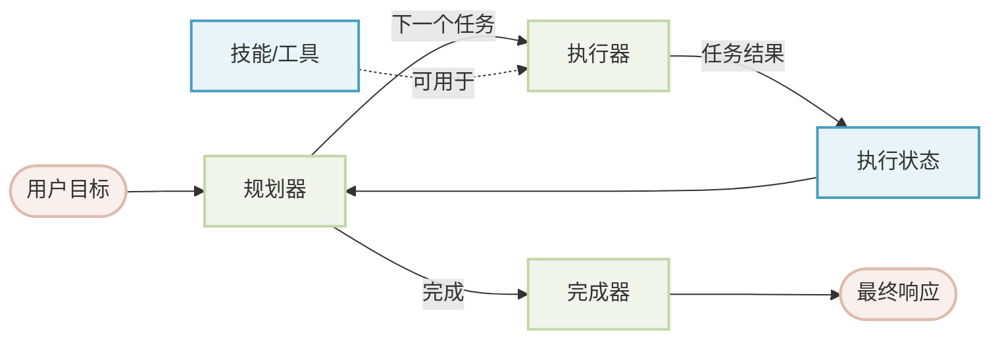
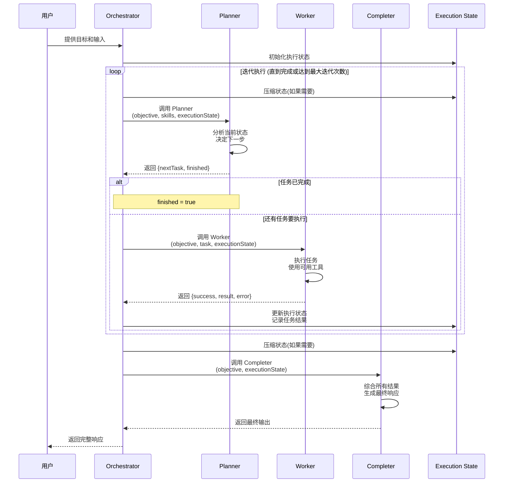

# Orchestrator Agent (编排器智能体)

中文版 | [English](README.md)

Orchestrator Agent 是一种高级智能体模式，通过三阶段架构实现自主任务规划和执行：**Planner(规划器) → Worker(执行器) → Completer(完成器)**。它将复杂目标分解为可管理的任务，迭代执行这些任务，并综合最终结果。

## 目录

- [架构概览](#架构概览)
- [核心概念](#核心概念)
- [使用方法](#使用方法)
  - [基于 YAML 的基本用法](#基于-yaml-的基本用法)
  - [自定义组件](#自定义组件)
- [配置参考](#配置参考)
- [高级功能](#高级功能)
- [示例](#示例)
- [最佳实践](#最佳实践)

## 架构概览



### 组件说明

1. **Planner (规划器)**: 分析目标和当前执行状态，决定下一个要执行的任务
2. **Worker (执行器)**: 使用可用的技能和工具执行分配的任务
3. **Completer (完成器)**: 将所有任务结果综合成最终的完整响应
4. **Execution State (执行状态)**: 跟踪整个工作流程中的任务历史、结果和状态

### 工作流程时序图



**关键流程说明:**

1. **初始化**: Orchestrator 接收用户输入并初始化执行状态
2. **迭代循环**:
   - 状态压缩: 根据配置限制执行状态大小
   - 规划阶段: Planner 基于当前状态决定下一个任务
   - 执行阶段: Worker 执行任务并返回结果
   - 状态更新: 任务结果被记录到执行状态中
3. **完成阶段**: Completer 综合所有任务结果生成最终响应

## 核心概念

### 执行流程

编排器采用迭代循环方式运行：

1. **规划阶段**: 规划器审查目标和执行状态，决定下一个任务
2. **执行阶段**: 执行器执行任务并返回结果
3. **状态更新**: 任务结果被添加到执行状态中
4. **重复**: 重复步骤 1-3，直到规划器标记目标完成
5. **完成阶段**: 完成器综合所有结果生成最终响应

### 任务记录结构

每个执行的任务都会被跟踪并记录以下信息：

```typescript
interface TaskRecord {
  task: string;              // 任务描述
  status: 'pending' | 'completed' | 'failed';
  result?: unknown;          // 任务执行结果
  error?: {                  // 任务失败时的错误信息
    message: string;
  };
  createdAt?: number;        // 任务创建时间戳
  completedAt?: number;      // 任务完成时间戳
}
```

### 执行状态

执行状态维护所有任务的历史记录：

```typescript
interface ExecutionState {
  tasks: TaskRecord[];
}
```

## 使用方法

### 基于 YAML 的基本用法

使用 Orchestrator 最简单的方式是通过 YAML 配置：

**orchestrator.yaml**
```yaml
type: "@aigne/agent-library/orchestrator"
name: orchestrator

# 可选：定义自定义输入字段
# 任何要在 objective 模板中使用的字段都必须在此声明
input_schema:
  type: object
  properties:
    message:
      type: string
      description: 用户自定义指令
  required: []

# 定义总体目标
objective:
  url: objective.md

# 可选：自定义状态管理
state_management:
  max_iterations: 20        # 最大规划-执行循环次数
  max_tokens: 100000       # 执行状态的 token 限制
  keep_recent: 20          # 仅保留最近的 N 个任务

# 可选：配置智能体文件系统
afs:
  modules:
    - module: local-fs
      options:
        name: workspace
        localPath: .
        description: 编排器智能体的工作目录
```

**objective.md**
```markdown
分析项目结构并生成综合报告。

- 忽略 node_modules、.git、dist、build 等目录
- 基于实际文件内容提供准确信息
- 包含关键发现和建议


## 用户指令
{{ message }}

```

**aigne.yaml**
```yaml
#!/usr/bin/env aigne

model: google/gemini-2.5-pro
agents:
  - agents/orchestrator.yaml
```

### 自定义组件

你可以自定义三个核心组件（planner、worker、completer）中的任意一个。每个组件都有标准的输入输出参数,自定义时应该合理使用这些参数。

#### 自定义规划器 (Planner)

**标准输入参数:**
- `objective` (string): 用户的总体目标
- `skills` (array): 可用的技能列表
- `executionState` (object): 当前执行状态,包含所有已执行任务的历史

**标准输出参数:**
- `nextTask` (string, 可选): 下一个要执行的任务描述
- `finished` (boolean, 可选): 是否完成所有任务

**orchestrator.yaml**
```yaml
type: "@aigne/agent-library/orchestrator"
objective:
  url: objective.md

planner:
  type: ai
  instructions:
    url: custom-planner.md
```

**custom-planner.md**
```markdown
## 你的角色
你是代码分析任务的战略规划者。

## 目标
{{ objective }}

## 可用技能
{{ skills | yaml.stringify }}

## 当前执行状态
{{ executionState | yaml.stringify }}

## 规划指南
- 优先处理高影响力的领域
- 将相关的分析任务分组
- 考虑任务之间的依赖关系
- 查看 executionState 中已完成的任务,避免重复工作
- 根据可用的 skills 规划任务
- 分析完成时设置 finished: true

## 输出格式
返回包含以下字段的对象:
- `nextTask`: 下一个要执行的任务描述(如果已完成则省略)
- `finished`: 布尔值,表示是否完成所有任务
```

#### 自定义执行器 (Worker)

**标准输入参数:**
- `objective` (string): 用户的总体目标(仅供参考)
- `task` (string): 当前要执行的具体任务
- `executionState` (object): 当前执行状态,可用于了解之前任务的结果

**标准输出参数:**
- `result` (string, 可选): 任务执行结果
- `success` (boolean): 任务是否成功完成
- `error` (object, 可选): 错误信息,包含 `message` 字段

**orchestrator.yaml**
```yaml
worker:
  type: ai
  instructions:
    url: custom-worker.md
```

**custom-worker.md**
```markdown
## 你的角色
你是专业的代码分析执行器。

## 总体目标 (仅供参考)
{{ objective }}

**重要**: 总体目标仅用于理解上下文,你只需要执行下面分配的具体任务。

## 当前任务
{{ task }}

## 执行状态
{{ executionState | yaml.stringify }}

## 执行指南
- 专注于完成当前任务,不要尝试完成整个目标
- 可以参考 executionState 中之前任务的结果
- 使用可用的工具和技能完成任务
- 如果任务无法完成,在 error 中说明原因

## 输出格式
返回包含以下字段的对象:
- `success`: 布尔值,表示任务是否成功
- `result`: 字符串,描述任务执行结果(成功时必需)
- `error`: 对象,包含 `message` 字段(失败时必需)
```

#### 自定义完成器 (Completer)

**标准输入参数:**
- `objective` (string): 用户的总体目标
- `executionState` (object): 完整的执行状态,包含所有已执行任务

**标准输出参数:**
由用户通过 `output_schema` 自定义,可以是任何结构

**orchestrator.yaml**
```yaml
completer:
  type: ai
  instructions:
    url: custom-completer.md
  output_schema:
    type: object
    properties:
      summary:
        type: string
        description: 执行摘要
      details:
        type: object
        description: 详细发现
      recommendations:
        type: array
        items:
          type: string
        description: 行动建议
    required: [summary]
```

**custom-completer.md**
```markdown
## 你的角色
你负责综合所有任务结果并生成最终响应。

## 用户目标
{{ objective }}

## 执行结果
{{ executionState | yaml.stringify }}

## 综合指南
- 分析 executionState 中所有任务的结果
- 注意区分成功和失败的任务
- 将零散的结果整合成连贯的响应
- 按照输出 schema 的结构组织内容

## 输出格式
返回符合定义的 output_schema 的对象,包含:
- `summary`: 执行摘要
- `details`: 详细发现
- `recommendations`: 行动建议列表
```

## 配置参考

### OrchestratorAgentOptions

| 选项 | 类型 | 必需 | 描述 |
|--------|------|----------|-------------|
| `objective` | `PromptBuilder` | 是 | 编排器的总体目标 |
| `planner` | `Agent` | 否 | 自定义规划器智能体（未提供则使用默认值） |
| `worker` | `Agent` | 否 | 自定义执行器智能体（未提供则使用默认值） |
| `completer` | `Agent` | 否 | 自定义完成器智能体（未提供则使用默认值） |
| `stateManagement` | `StateManagementOptions` | 否 | 管理执行状态的配置 |
| `inputSchema` | `ZodSchema` | 否 | 输入验证的 schema |
| `outputSchema` | `ZodSchema` | 否 | 输出验证的 schema |
| `afs` | `AFSOptions` | 否 | 智能体文件系统配置 |
| `skills` | `Agent[]` | 否 | 执行器可用的工具/技能 |
| `model` | `string` | 否 | 所有组件的默认模型 |

> **重要提示**: 在 `objective` 模板中使用自定义输入字段（例如 `{{ topic }}`、`{{ message }}`）时，必须在 `inputSchema` 中声明这些字段。任何未声明的字段在模板上下文中都不可用。

### StateManagementOptions

| 选项 | 类型 | 默认值 | 描述 |
|--------|------|---------|-------------|
| `maxIterations` | `number` | 20 | 最大规划-执行循环次数 |
| `maxTokens` | `number` | - | 执行状态允许的最大 token 数 |
| `keepRecent` | `number` | - | 压缩状态时保留的最近任务数量 |

### 状态压缩

为了防止长时间运行时的上下文溢出，编排器可以压缩执行状态：

1. **keepRecent**: 仅保留最近的 N 个任务
2. **maxTokens**: 应用 token 限制，保留符合要求的最近任务
3. 两个选项协同工作：首先应用 `keepRecent`，然后应用 `maxTokens`

```yaml
state_management:
  max_iterations: 50       # 允许多次迭代
  max_tokens: 80000       # 但限制上下文大小
  keep_recent: 30         # 保留最多 30 个最近任务（如果它们符合 token 限制）
```

## 高级功能

### 通过智能体文件系统共享上下文

编排器及其所有组件都可以访问智能体文件系统：

```yaml
afs:
  modules:
    - module: local-fs
      options:
        name: workspace
        localPath: .
    - module: local-fs
      options:
        name: output
        localPath: ./output
```

所有组件（planner、worker、completer）都可以通过 AFS 读写文件。

### 错误处理

编排器会优雅地处理任务失败。当任务失败时，会在执行状态中记录错误信息：

```yaml
task: "读取不存在的文件"
status: "failed"
error:
  message: "找不到文件: /path/to/missing.txt"
```

规划器接收失败信息后可以：
- 尝试使用不同方法重试
- 跳过该任务并继续
- 尽管失败仍将目标标记为完成

### 迭代控制

你可以控制最大规划-执行循环次数：

```yaml
state_management:
  max_iterations: 30  # 允许最多 30 次规划-执行循环
```

当达到 `maxIterations` 时，编排器会停止并使用可用结果调用完成器。

## 示例

### 示例 1: 项目文档生成器

通过探索项目生成综合文档：

**orchestrator.yaml**
```yaml
type: "@aigne/agent-library/orchestrator"
objective: |
  探索代码库并生成综合文档，包括：
  - 项目概述和架构
  - API 参考
  - 安装说明
  - 使用示例

state_management:
  max_iterations: 15

afs:
  modules:
    - module: local-fs
      options:
        name: source
        localPath: ./src
    - module: local-fs
      options:
        name: docs
        localPath: ./docs
```

### 示例 2: 研究和报告生成

进行研究并生成结构化报告：

```yaml
type: "@aigne/agent-library/orchestrator"
name: researcher

# 重要：声明自定义输入字段
input_schema:
  type: object
  properties:
    topic:
      type: string
      description: 研究主题
    depth:
      type: string
      enum: [basic, detailed, comprehensive]
      description: 研究深度
  required: [topic]

objective:
  content: |
    研究 {{ topic }} 并生成综合报告，包括：
    - 背景和上下文
    - 当前技术现状
    - 关键发现
    - 未来方向

    
    研究深度: {{ depth }}
    

planner:
  type: ai
  instructions: |
    系统地规划研究任务：
    1. 背景研究
    2. 深入调查
    3. 交叉引用和验证
    4. 报告综合

completer:
  type: ai
  output_schema:
    type: object
    properties:
      title:
        type: string
      executive_summary:
        type: string
      sections:
        type: array
        items:
          type: object
          properties:
            heading:
              type: string
            content:
              type: string
      references:
        type: array
        items:
          type: string

state_management:
  max_iterations: 20
  max_tokens: 100000
```

## 最佳实践

### 1. 为复杂任务自定义 Planner

对于复杂任务,应该自定义 Planner 的 instructions。**关键原则**: Planner 应该专注于任务规划和分配,而不是执行任务。

**好的 Planner 示例** (参考 [workflow-orchestrator example](../../../examples/workflow-orchestrator/agents/planner.md)):

```markdown
## 你的职责

你的职责是根据当前执行状态决定下一个任务。

## 规划目标
{{ objective }}

## 当前执行状态
{{ executionState | yaml.stringify }}

## 重要原则

- **一次只规划一个具体任务**,不要试图完成整个探索过程
- **不要执行任务**,只决定下一步应该做什么
- **信任迭代过程**,每个任务完成后你会被再次调用来决定下一步
- **避免重复工作**,审查执行历史以了解已完成的内容
- 任务描述应该是**面向目标的**,不要指定具体操作,让 Worker 自主决定如何完成任务

## 输出格式
返回包含以下字段的对象:
- `nextTask`: 下一个要执行的任务描述(如果已完成则省略)
- `finished`: 布尔值,表示是否完成
- `reasoning`: (可选)简要说明为什么需要这个任务
```

**不好的 Planner 示例**:
```markdown
分析代码并修复所有问题。使用以下工具读取文件、分析代码、生成报告...
```
❌ 这样的 Planner 试图指导执行细节,应该由 Worker 来处理。

### 2. 设计清晰的目标

使目标具体且可操作：

**好的示例:**
```markdown
分析 /src/auth 中的认证系统并识别：
- 安全漏洞
- 性能瓶颈
- 代码质量问题
为发现的每个问题提供具体建议。
```

**不好的示例:**
```markdown
看看代码有什么问题。
```

### 3. 设置合适的迭代限制

根据任务复杂度设置 `maxIterations`：

- 简单探索: 5-10 次迭代
- 复杂分析: 15-25 次迭代
- 开放式研究: 30-50 次迭代

### 4. 为长工作流使用状态压缩

对于包含多个任务的工作流，使用状态压缩：

```yaml
state_management:
  max_iterations: 50
  max_tokens: 80000      # 防止上下文溢出
  keep_recent: 25        # 保留最近任务以保持连续性
```

### 5. 通过 AFS 提供上下文

使用智能体文件系统在任务之间共享数据：

```yaml
afs:
  modules:
    - module: local-fs
      options:
        name: workspace
        localPath: .
    - module: local-fs
      options:
        name: cache
        localPath: ./.cache
        description: 中间结果缓存
```

### 6. 优雅地处理失败

在 Planner 中设计失败处理逻辑：

```markdown
当任务失败时：
- 审查错误消息
- 考虑任务是否必要
- 如果可能，尝试替代方法
- 如果可能，继续执行剩余任务
```

### 7. 为每个组件使用合适的模型

根据组件职责选择不同的模型以优化性能和成本：

```yaml
type: "@aigne/agent-library/orchestrator"
objective:
  url: objective.md

# 规划器使用强大的模型进行战略思考
planner:
  type: ai
  model: anthropic/claude-3-5-sonnet-20241022
  instructions:
    url: planner.md

# 执行器使用快速模型提高执行效率
worker:
  type: ai
  model: google/gemini-2.0-flash

# 完成器使用强大的模型进行高质量综合
completer:
  type: ai
  model: anthropic/claude-3-5-sonnet-20241022
```

### 8. 验证输入和输出

为类型安全定义 schema。**关键**: 所有自定义输入字段都必须在 `input_schema` 中声明，特别是在 objective 模板中使用的字段：

```yaml
input_schema:
  type: object
  properties:
    target:
      type: string
      description: 要分析的目标目录
    depth:
      type: number
      description: 分析深度 (1-3)
    includeTests:
      type: boolean
      description: 是否包含测试分析
      default: false
  required: [target]

output_schema:
  type: object
  properties:
    summary:
      type: string
    findings:
      type: array
    recommendations:
      type: array
```

### 9. 迭代测试

从简单开始，逐步增加复杂度：

1. 使用简单目标和少量迭代进行测试
2. 验证每个组件正常工作
3. 逐步增加复杂度
4. 监控性能并调整限制
