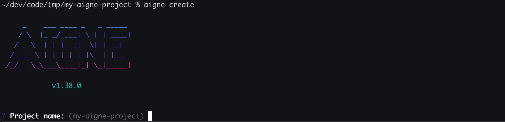
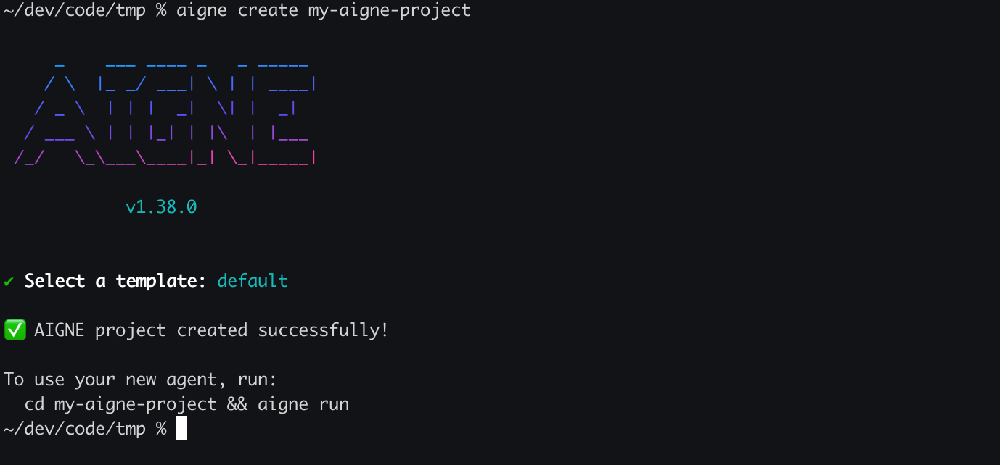

# aigne create

`aigne create` コマンドは、テンプレートから新しい AIGNE プロジェクトの雛形を作成します。これにより、必要なディレクトリ構造と設定ファイルがセットアップされ、すぐに Agent の開発を開始できます。

## 使用法

```bash 基本的な使用法 icon=lucide:terminal
aigne create [path]
```

## 引数

<x-field data-name="path" data-type="string" data-default="." data-required="false" data-desc="新しいプロジェクトディレクトリが作成されるパス。省略された場合、現在のディレクトリがデフォルトとなり、プロジェクト名を尋ねる対話モードが起動します。"></x-field>

## 対話モード

パスを指定せずに、または現在のディレクトリに `.` を使用して `aigne create` を実行すると、CLI はセットアッププロセスをガイドする対話モードに入ります。以下の情報の入力を求められます：

*   **プロジェクト名**: 新しいプロジェクトディレクトリの名前。
*   **テンプレート**: 使用するプロジェクトテンプレート。現在は `default` テンプレートのみが利用可能です。



### 上書きの確認

安全のため、ターゲットディレクトリがすでに存在し、空でない場合、CLI はその内容を削除する前に確認を求めます。続行しないことを選択した場合、操作は安全にキャンセルされます。

```text 確認プロンプト
? The directory "/path/to/my-aigne-project" is not empty. Do you want to remove its contents? (y/N)
```

## 例

### 対話形式でプロジェクトを作成

作成プロセスをガイドしてもらうには、引数なしでコマンドを実行します。CLI がプロジェクト名の入力を求めます。

```bash 現在のディレクトリに作成 icon=lucide:terminal
aigne create
```

### 特定のディレクトリにプロジェクトを作成

`my-awesome-agent` という名前の新しいディレクトリにプロジェクトを作成するには、その名前を引数として指定します。

```bash 新しい 'my-awesome-agent' ディレクトリに作成 icon=lucide:terminal
aigne create my-awesome-agent
```

このコマンドは `my-awesome-agent` ディレクトリを作成し、その中にプロジェクトの雛形を作成します。テンプレートの選択も求められます。

## 成功時の出力

作成が成功すると、確認メッセージと、新しい Agent を実行するための次のステップに関する指示が表示されます。



---

プロジェクトを作成したら、次のステップは Agent の実行です。詳細については、[`aigne run`](./command-reference-run.md) コマンドリファレンスを参照してください。
