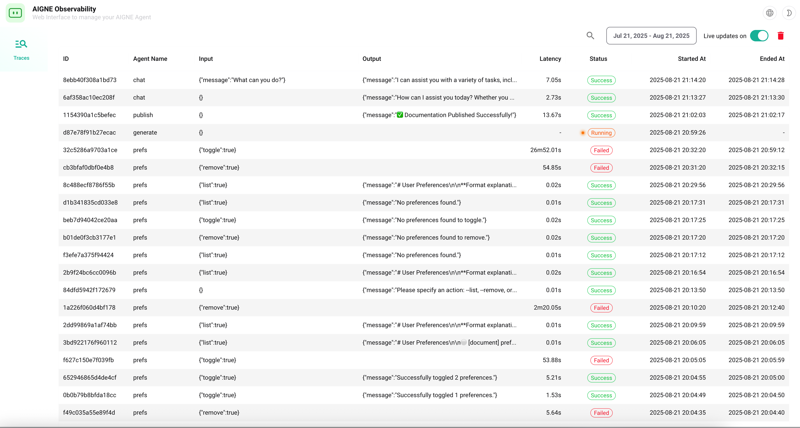
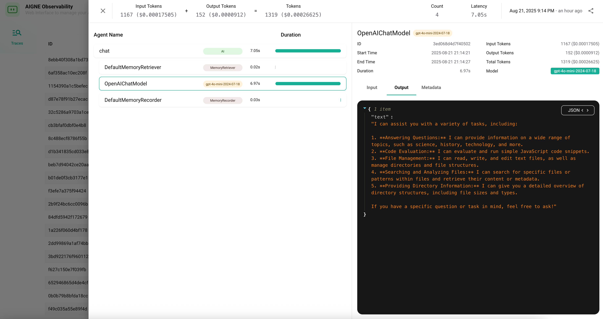

# aigne observe

The `aigne observe` command launches a local web server for monitoring and analyzing agent execution data. It provides a user-friendly interface to inspect traces, view detailed call information, and understand your agents' behavior during runs. This tool is essential for debugging, performance tuning, and gaining deep insights into how your agents process information and interact with various tools and models.

## Usage

To start the observability server, run the following command in your terminal:

```bash Usage icon=lucide:terminal
aigne observe [options]
```

Upon starting, the CLI will print the server URL and the path to the local observability database.



## How It Works

The `observe` command starts a web application that reads from a local SQLite database where AIGNE stores all execution traces. Each time you run an agent (using `aigne run` or `aigne serve-mcp`), the framework automatically records detailed logs of the execution flow. These logs then become available for inspection in the observability UI.

The UI allows you to browse a list of all recorded traces and drill down into specific ones to see a step-by-step breakdown of the agent's operations, including inputs, outputs, tool calls, and model responses.



## Options

<x-field data-name="--host" data-type="string" data-default="localhost" data-desc="Specifies the host address for the server. Use `0.0.0.0` to expose the server to other devices on your local network."></x-field>
<x-field data-name="--port" data-type="number" data-default="7890" data-desc="Sets the port number for the server to listen on. If the specified port is unavailable, it will attempt to find the next available one. Can also be set via the `PORT` environment variable."></x-field>

## Examples

### Start the server on the default port

Running the command without any options starts the server with the default settings.

```bash Start with default settings icon=lucide:play
aigne observe
```

**Expected Output:**

```text Console Output
Observability database path: /path/to/your/project/.aigne/observability.db
Observability server is running at http://localhost:7890
```

You can then open `http://localhost:7890` in your web browser to access the UI.

### Start the server on a specific port

Use the `--port` option to specify a different port.

```bash Start on a custom port icon=lucide:play-circle
aigne observe --port 8080
```

This will start the server on `http://localhost:8080` (or the next available port if 8080 is in use).

### Expose the server to your local network

To allow other devices on your network to access the observability UI, set the host to `0.0.0.0`.

```bash Expose the server publicly icon=lucide:globe
aigne observe --host 0.0.0.0
```

The server will then be accessible via `http://<your-local-ip>:7890`.