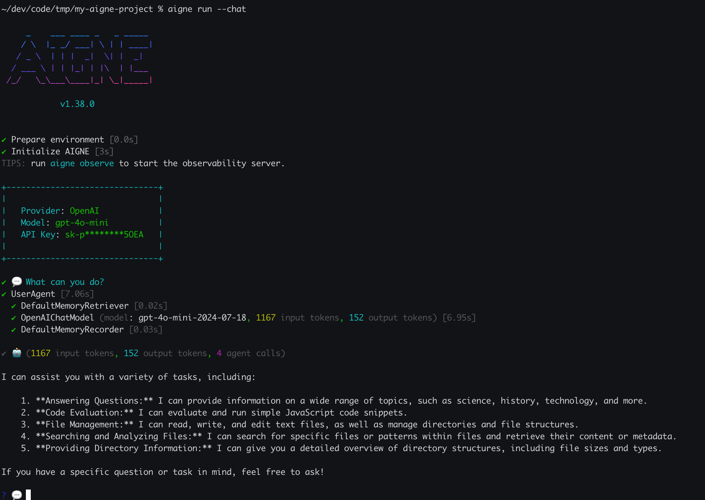

# aigne run

`aigne run` コマンドは、AIGNE agent を実行するための主要な方法です。ローカルのプロジェクトディレクトリから、またはリモートURLから直接 agent を実行できます。入力の提供、AIモデルの設定、出力の処理に関する柔軟なオプションを提供し、対話型 agent のためのインタラクティブなチャットモードも含まれています。

## 使用方法

```bash 基本構文
aigne run [path] [agent_name] [options]
```

### 引数

-   `[path]` (任意): AIGNE プロジェクトディレクトリへのパス、またはリモートURL (例: Gitリポジトリ)。省略した場合、現在のディレクトリ (`.`) がデフォルトになります。
-   `[agent_name]` (任意): プロジェクトから実行する特定の agent。指定しない場合、CLI は `aigne.yaml` で定義された `entry-agent` またはデフォルトの `chat` agent を使用し、それらがない場合はリストされている最初の agent を使用します。

## 仕組み

`run` コマンドはまず AIGNE アプリケーションをロードします。リモートURLが指定された場合、処理を進める前にプロジェクトをローカルにダウンロードしてキャッシュします。その後、コマンドライン引数を解析し、指定された agent を与えられた入力とモデル設定で実行します。

```d2 リモート実行フロー icon=lucide:workflow
direction: down

User: {
  shape: c4-person
}

CLI: {
  label: "@aigne/cli"
  
  Download: {
    label: "パッケージのダウンロード"
  }

  Extract: {
    label: "パッケージの展開"
  }

  Load: {
    label: "アプリケーションのロード"
  }

  Execute: {
    label: "Agent の実行"
  }
}

Remote-URL: {
  label: "リモートURL\n(例: GitHub)"
  shape: cylinder
}

Cache-Dir: {
  label: "キャッシュディレクトリ\n(~/.aigne/.download)"
  shape: cylinder
}

Local-Dir: {
  label: "ローカルディレクトリ\n(~/.aigne/<hostname>/...)"
  shape: cylinder
}

User -> CLI: "aigne run <url>"
CLI.Download -> Remote-URL: "1. プロジェクトをフェッチ"
Remote-URL -> CLI.Download: "2. tarball を返す"
CLI.Download -> Cache-Dir: "3. tarball を保存"
CLI.Extract -> Cache-Dir: "4. tarball を読み込む"
CLI.Extract -> Local-Dir: "5. プロジェクトファイルを展開"
CLI.Load -> Local-Dir: "6. aigne.yaml と .env をロード"
CLI.Execute -> CLI.Load: "7. agent を実行"
CLI.Execute -> User: "8. 出力を表示"
```

## 例

### ローカル Agent の実行

ローカルのファイルシステム上にあるプロジェクトから agent を実行します。

```bash 現在のディレクトリから実行 icon=lucide:folder-dot
# 現在のディレクトリでデフォルトの agent を実行
aigne run
```

```bash 特定の agent を実行 icon=lucide:locate-fixed
# 特定のプロジェクトパスにある 'translator' agent を実行
aigne run path/to/my-project translator
```

### リモート Agent の実行

Git リポジトリや tarball の URL から直接 agent を実行できます。CLI はプロジェクトのダウンロードとホームディレクトリ (`~/.aigne`) へのキャッシュを処理します。

```bash GitHub リポジトリから実行 icon=lucide:github
aigne run https://github.com/AIGNE-io/aigne-framework/tree/main/examples/default
```

### インタラクティブチャットモードでの実行

対話型 agent の場合、`--chat` フラグを使用してインタラクティブなターミナルセッションを開始します。



```bash チャットセッションを開始 icon=lucide:messages-square
aigne run --chat
```

チャットループ内では、`/exit` のようなコマンドで終了したり、`/help` でヘルプを表示したりできます。また、パスの前に `@` を付けることで、ローカルファイルをメッセージに添付することもできます。

```
💬 このファイルについて教えてください: @/path/to/my-document.pdf
```

## Agent への入力提供

`aigne.yaml` で定義された入力スキーマに応じて、agent に入力を提供する方法は複数あります。

#### コマンドラインオプションとして

agent の入力スキーマが特定のパラメータ (例: `text`, `targetLanguage`) を定義している場合、それらをコマンドラインオプションとして渡すことができます。

```bash agent 固有のパラメータを渡す icon=lucide:terminal
# 'translator' agent が 'text' と 'targetLanguage' の入力を持つと仮定
aigne run translator --text "Hello, world!" --targetLanguage "Spanish"
```

#### 標準入力 (stdin) から

コンテンツを直接 `run` コマンドにパイプできます。これはコマンドを連結するのに便利です。

```bash agent に入力をパイプする icon=lucide:pipe
echo "Summarize this important update." | aigne run summarizer
```

#### ファイルから

ファイルからコンテンツを読み込んで入力として渡すには、`@` プレフィックスを使用します。

-   **`--input @<file>`**: ファイル全体のコンテンツを主要な入力として読み込みます。
-   **`--<param> @<file>`**: 特定の agent パラメータのためにファイルコンテンツを読み込みます。

```bash ファイルから入力を読み込む icon=lucide:file-text
# document.txt の内容をメイン入力として使用
aigne run summarizer --input @document.txt

# 複数のパラメータに対して構造化された JSON 入力を提供
aigne run translator --input @request-data.json --format json
```

#### マルチメディアファイルの入力

画像やドキュメントなどのファイルを処理する agent (例: Vision モデル) の場合、`--input-file` オプションを使用します。

```bash Vision agent 用にファイルを添付 icon=lucide:image-plus
aigne run image-describer --input-file cat.png --input "What is in this image?"
```

## オプションリファレンス

### 一般的なオプション

| オプション | 説明 |
|---|---|
| `--chat` | agent をターミナル内のインタラクティブなチャットループで実行します。 |
| `--log-level <level>` | ログレベルを設定します。利用可能なレベル: `debug`、`info`、`warn`、`error`、`silent`。デフォルト: `silent`。 |

### モデルオプション

これらのオプションを使用すると、`aigne.yaml` で定義されたモデル設定を上書きできます。

| オプション | 説明 |
|---|---|
| `--model <provider[:model]>` | 使用するAIモデルを指定します (例: 'openai' または 'openai:gpt-4o-mini')。 |
| `--temperature <value>` | モデルの temperature (0.0-2.0)。値が高いほどランダム性が増します。 |
| `--top-p <value>` | モデルの top-p / nucleus sampling (0.0-1.0)。応答の多様性を制御します。 |
| `--presence-penalty <value>` | presence penalty (-2.0 から 2.0)。繰り返されるトークンにペナルティを課します。 |
| `--frequency-penalty <value>` | frequency penalty (-2.0 から 2.0)。頻繁に出現するトークンにペナルティを課します。 |
| `--aigne-hub-url <url>` | リモートのモデルや agent をフェッチするためのカスタム AIGNE Hub サービス URL。 |

### 入出力オプション

| オプション | エイリアス | 説明 |
|---|---|---|
| `--input <value>` | `-i` | agent への入力。複数回指定できます。ファイルから読み込むには `@<file>` を使用します。 |
| `--input-file <path>` | | agent への入力ファイルのパス (例: Vision モデル用)。複数回指定できます。 |
| `--format <format>` | | `--input @<file>` を使用する際の入力形式。選択肢: `text`、`json`、`yaml`。 |
| `--output <file>` | `-o` | 結果を保存するファイルへのパス。デフォルトでは標準出力に出力されます。 |
| `--output-key <key>` | | agent の結果オブジェクト内で、出力ファイルに保存するキー。デフォルトは `output` です。 |
| `--force` | | 出力ファイルが既に存在する場合に上書きします。親ディレクトリが存在しない場合は作成します。 |

---

## 次のステップ

<x-cards>
  <x-card data-title="aigne observe" data-icon="lucide:monitor-dot" data-href="/command-reference/observe">
    可観測性サーバーを起動して、agent 実行の詳細なトレースを表示する方法を学びます。
  </x-card>
  <x-card data-title="Running Remote Agents" data-icon="lucide:cloudy" data-href="/guides/running-remote-agents">
    リモートURLから直接 agent を実行する詳細について深く掘り下げます。
  </x-card>
  <x-card data-title="Creating a Custom Agent" data-icon="lucide:bot" data-href="/guides/creating-a-custom-agent">
    AIGNE CLI で使用する独自の agent とスキルの構築を始めましょう。
  </x-card>
</x-cards>