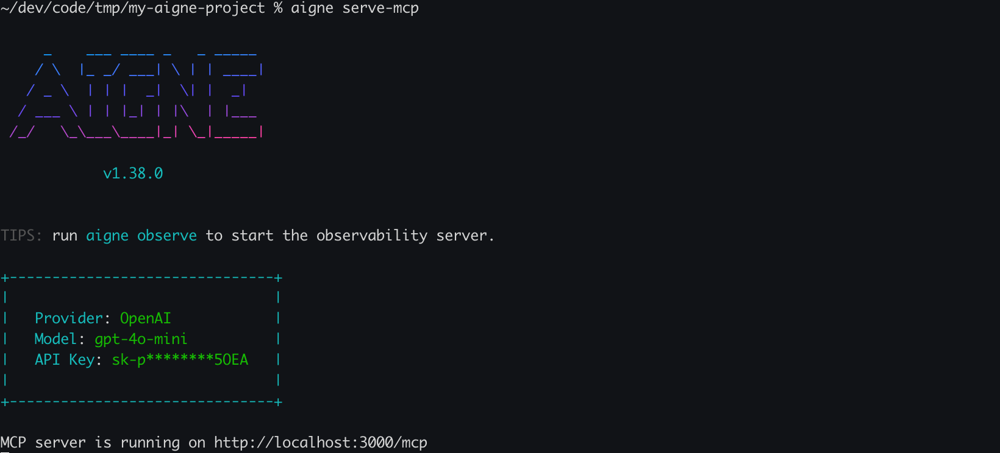

# aigne serve-mcp

AIGNE プロジェクト内の Agent をモデルコンテキストプロトコル (MCP) サーバーとして提供します。このコマンドは、ストリーミング可能な HTTP エンドポイントを介して Agent を公開し、MCP 標準をサポートする外部システムやアプリケーションとのシームレスな統合を可能にします。

内部的に、`aigne serve-mcp` は軽量な Express サーバーを起動します。設定されたエンドポイントで POST リクエストを受信すると、対応する Agent を呼び出し、MCP 仕様に従ってレスポンスをストリーミングで返します。



## 使用法

```bash 基本的な使用法 icon=lucide:terminal
aigne serve-mcp [options]
```

## オプション

`serve-mcp` コマンドは、サーバーの動作をカスタマイズするために以下のオプションを受け入れます：

<x-field data-name="--path, --url" data-type="string" data-default="." data-desc="ローカルの Agent ディレクトリへのパス、またはリモートの AIGNE プロジェクトへの URL。"></x-field>

<x-field data-name="--host" data-type="string" data-default="localhost" data-desc="MCP サーバーを実行するホスト。ネットワークにサーバーを公開するには `0.0.0.0` を使用します。"></x-field>

<x-field data-name="--port" data-type="number" data-default="3000" data-desc="MCP サーバーのポート。`PORT` 環境変数が設定されている場合、コマンドはそれを尊重します。それ以外の場合は、デフォルトで 3000 になります。"></x-field>

<x-field data-name="--pathname" data-type="string" data-default="/mcp" data-desc="MCP サービスエンドポイントの URL パス。"></x-field>

<x-field data-name="--aigne-hub-url" data-type="string" data-desc="リモートの Agent 定義やモデルを取得するために使用される、カスタムの AIGNE Hub サービス URL。"></x-field>

## 例

### ローカルプロジェクトのサーバーを起動する

現在のディレクトリから Agent を提供するには、オプションなしでコマンドを実行します。サーバーはデフォルトのホストとポートで起動します。

```bash 現在のディレクトリでサーバーを起動 icon=lucide:play-circle
aigne serve-mcp
```

**期待される出力:**

```text コンソール出力 icon=lucide:server
MCP server is running on http://localhost:3000/mcp
```

### 特定のポートとパスで Agent を提供する

別のポートを指定し、AIGNE プロジェクトディレクトリへの明示的なパスを提供できます。

```bash カスタムポートとパスでサーバーを起動 icon=lucide:play-circle
aigne serve-mcp --path ./my-ai-project --port 8080
```

**期待される出力:**

```text コンソール出力 icon=lucide:server
MCP server is running on http://localhost:8080/mcp
```

### サーバーをネットワークに公開する

MCP サーバーをネットワーク上の他のマシンからアクセス可能にするには、ホストを `0.0.0.0` に設定します。

```bash サーバーを公開する icon=lucide:play-circle
aigne serve-mcp --host 0.0.0.0
```

**期待される出力:**

```text コンソール出力 icon=lucide:server
MCP server is running on http://0.0.0.0:3000/mcp
```

## 次のステップ

MCP サーバーを介して Agent を公開した後、本番環境用にデプロイすることを検討するとよいでしょう。

<x-cards>
  <x-card data-title="aigne deploy コマンド" data-icon="lucide:ship" data-href="/command-reference/deploy">
    AIGNE アプリケーションを Blocklet としてデプロイする方法を学びます。
  </x-card>
  <x-card data-title="Agent のデプロイガイド" data-icon="lucide:book-open-check" data-href="/guides/deploying-agents">
    Agent をデプロイするためのステップバイステップのチュートリアルに従います。
  </x-card>
</x-cards>
