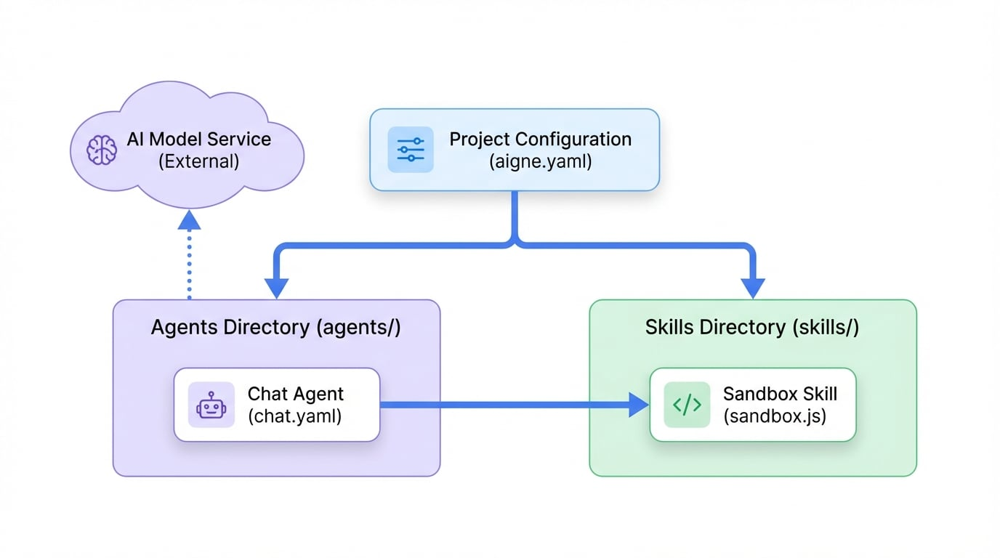

# 核心概念

AIGNE 项目为开发、测试和部署 AI Agent 提供了一个结构化的环境。其核心是一个包含配置文件的目录，这些文件定义了你的 Agent、它们可以使用的技能以及它们连接的语言模型。本节将分解这些基本构建块。

## 项目结构

当你使用 `aigne create` 创建一个新项目时，它会搭建一个标准的目录结构，以保持组件的组织性。一个典型的项目如下所示：

```text Project Structure icon=mdi:folder-open
my-agent-project/
├── aigne.yaml        # 主项目配置文件。
├── agents/           # Agent 定义文件目录。
│   └── chat.yaml     # Agent 定义示例。
└── skills/           # 技能实现文件目录。
    └── sandbox.js    # 技能实现示例。
```

这种结构将配置（`aigne.yaml`、`agents/`）与实现（`skills/`）分开，使你的项目模块化且易于管理。

## 它们如何协同工作

下图说明了 AIGNE 项目核心组件之间的关系。中心的 `aigne.yaml` 文件协调一切，定义了存在哪些 Agent、它们可以使用哪些技能，以及哪个 AI 模型为其智能提供动力。

<!-- DIAGRAM_IMAGE_START:architecture:16:9 -->

<!-- DIAGRAM_IMAGE_END -->

要理解 AIGNE 项目如何工作，必须掌握其两个主要组成部分：中央项目配置以及可执行的 Agent 和技能。在下面更详细地探索它们。

<x-cards>
  <x-card data-title="项目配置 (aigne.yaml)" data-icon="lucide:file-cog" data-href="/core-concepts/project-configuration">
    这是你项目的主要清单文件。它定义了要使用的聊天模型，列出了可用的 Agent，并注册了这些 Agent 可以访问的技能。
  </x-card>
  <x-card data-title="Agent 和技能" data-icon="lucide:bot" data-href="/core-concepts/agents-and-skills">
    Agent 是执行任务的核心行动者，由其指令和能力定义。技能是 Agent 使用的工具，实现为提供特定功能的函数（例如，JavaScript 模块）。
  </x-card>
</x-cards>

---

有了这些基础知识，你就可以更深入地了解如何配置你的项目了。

**下一步**：在[项目配置 (aigne.yaml)](./core-concepts-project-configuration.md) 指南中了解有关主配置文件的更多信息。
