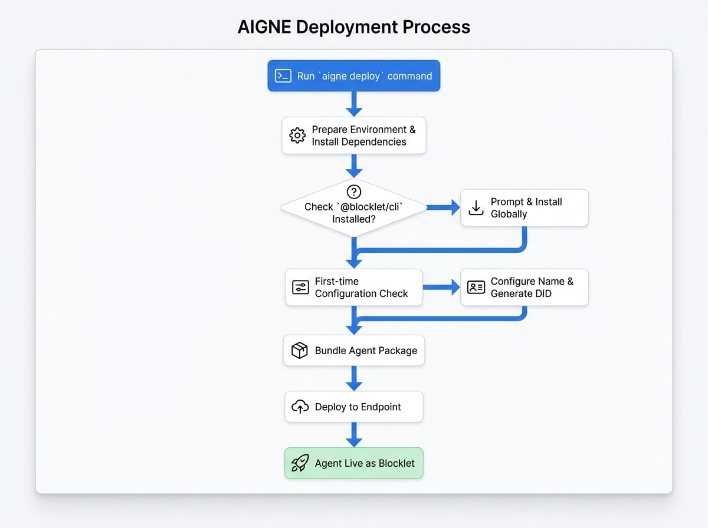

# 部署 Agent

部署你的 AIGNE 项目会将其从本地开发设置转变为一个独立的、可分发的应用程序，称为 Blocklet。这使你的 Agent 可以在生产环境中运行，与他人共享，并无缝集成到更广泛的 Blocklet 生态系统中。`aigne deploy` 命令会自动完成整个打包和部署过程。

本指南将引导你完成部署工作流。有关所有可用命令选项的详细说明，请参阅 [`aigne deploy` 命令参考](./command-reference-deploy.md)。

## 部署流程

`aigne deploy` 命令会协调一系列步骤来准备、配置、打包和部署你的 Agent。它在底层利用 `@blocklet/cli` 来处理创建 Blocklet 的复杂性。

以下是部署流程的概览：

<!-- DIAGRAM_IMAGE_START:guide:4:3 -->

<!-- DIAGRAM_IMAGE_END -->

### 分步详解

要部署你的项目，请导航到项目的根目录并运行部署命令，指定项目路径和目标端点。

```bash 命令 icon=lucide:terminal
aigne deploy --path . --endpoint <your-endpoint-url>
```

让我们来分解一下执行此命令时会发生什么：

1.  **环境准备**：CLI 首先会创建一个临时的 `.deploy` 目录。它会将你的项目文件和一个标准的 Blocklet 模板复制到该目录中。然后，它会在此目录内运行 `npm install` 来获取任何必要的依赖项。

2.  **Blocklet CLI 检查**：该过程会验证你的系统上是否安装了 `@blocklet/cli`。如果未安装，它将提示你授权进行全局安装。这是一次性设置。

    ```
    ? Install Blocklet CLI? ›
    ❯ yes
      no
    ```

3.  **Blocklet 配置（首次部署）**：如果这是你第一次部署该项目，CLI 将会要求你为 Blocklet 命名。它会根据 `aigne.yaml` 中你的 Agent 名称或项目文件夹的名称建议一个默认名称。

    ```
    ? Please input agent blocklet name: › my-awesome-agent
    ```

    在你提供名称后，它会自动为你的 Blocklet 生成一个新的去中心化标识符 (DID)。该名称和 DID 会保存在本地的 `~/.aigne/deployed.yaml` 文件中，因此在后续部署同一项目时，你将不会再被提示输入这些信息。

4.  **打包**：然后，CLI 会调用 `blocklet bundle --create-release`，该命令会将你的 Agent、其依赖项以及所有必要的配置打包成一个单一的、可部署的 `.blocklet/bundle` 文件。

5.  **部署**：最后，使用 `blocklet deploy` 命令将打包好的应用程序推送到你指定的 `--endpoint`。

该过程完成后，你将在终端中看到一条确认消息。

```
✅ Deploy completed: /path/to/your/project -> <your-endpoint-url>
```

你的 AIGNE Agent 现在已作为 Blocklet 上线，并准备好在生产环境中运行。