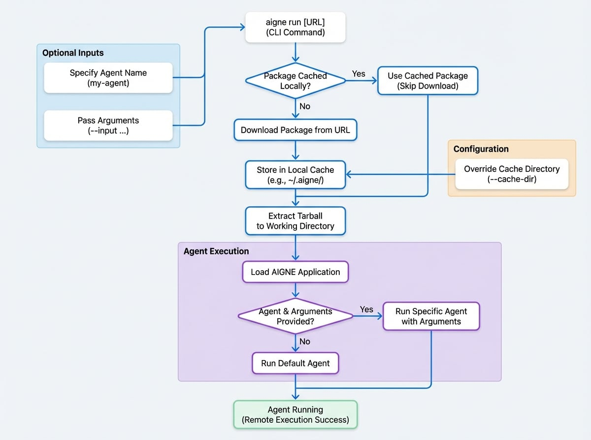

# リモート Agent の実行

AIGNE CLI は、ローカルファイルシステムからプロジェクトを実行するだけではありません。リモートURLから直接 Agent を実行する強力な機能も提供します。これは、リポジトリをクローンしたり、手動でファイルをダウンロードしたりすることなく、Agent のテスト、共有、実行に非常に便利です。

このガイドでは、リモートソースから Agent を実行する方法と、その基盤となるキャッシュメカニズムについて説明します。

## 仕組み

`aigne run` コマンドにURLを指定すると、CLIは以下の手順を自動的に実行します：

1.  **ダウンロード**: 指定されたHTTP/HTTPS URLからパッケージを取得します。
2.  **キャッシュ**: ダウンロードされたパッケージはローカルのキャッシュディレクトリ（デフォルトでは `~/.aigne/`）に保存されます。これにより、同じリモート Agent の後続の実行が高速化されます。CLIは、キャッシュされたバージョンが既に存在する場合にそれを使用します。
3.  **展開**: CLIはパッケージ（tarball形式であることが想定されています）の内容をキャッシュ内の作業ディレクトリに展開します。
4.  **実行**: 最後に、展開されたファイルからAIGNEアプリケーションを読み込み、ローカルプロジェクトと同様に指定された Agent を実行します。

プロセス全体が効率化されており、リモート Agent がローカルの Agent と同じようにアクセスしやすく感じられる、シームレスな体験を提供します。

<!-- DIAGRAM_IMAGE_START:flowchart:4:3 -->

<!-- DIAGRAM_IMAGE_END -->

## 使用方法

リモート Agent を実行するには、AIGNEプロジェクトのtarball（`.tar.gz`、`.tgz`）を指すURLを `aigne run` コマンドに渡すだけです。

### 基本コマンド

```bash AIGNE CLI icon=lucide:terminal
# リモートのAIGNEプロジェクトからデフォルトの Agent を実行
aigne run https://example.com/path/to/your/aigne-project.tar.gz
```

### 特定の Agent の実行

リモートプロジェクトに複数の Agent が含まれている場合、URLの後にその名前を追加して実行する Agent を指定できます。

```bash AIGNE CLI icon=lucide:terminal
# リモートプロジェクトから'my-agent'という名前の特定の Agent を実行
aigne run https://example.com/path/to/your/aigne-project.tar.gz my-agent
```

追加の引数やオプションは、リモート Agent に直接渡されます。

```bash AIGNE CLI icon=lucide:terminal
# 追加のオプションを付けて特定の Agent を実行
aigne run https://example.com/path/to/your/aigne-project.tar.gz my-agent --input "Hello, world!"
```

## キャッシュ

AIGNE CLIは、ダウンロードしたリモート Agent を自動的にキャッシュし、実行のたびに再ダウンロードするのを防ぎます。

*   **デフォルトの場所**: キャッシュはホームディレクトリ内の `.aigne` ディレクトリ（例： `~/.aigne/`）に保存されます。キャッシュ内の正確なパスはURLのホスト名とパスによって決定され、異なるリモート Agent が別々に保存されるようになっています。

*   **キャッシュディレクトリの上書き**: ほとんどの場合、デフォルトの場所で十分ですが、`--cache-dir` オプションを使用してカスタムキャッシュディレクトリを指定することもできます。これはCI/CD環境や、異なるキャッシュ済み Agent のセットを管理する場合に便利です。

```bash AIGNE CLI icon=lucide:terminal
# ダウンロードしたパッケージをキャッシュするためにカスタムディレクトリを使用
aigne run https://example.com/path/to/your/aigne-project.tar.gz --cache-dir /tmp/aigne-cache
```

この強力な機能により、AIGNE Agent のコラボレーションと配布が簡素化されます。次に、本番環境用に Agent をデプロイする方法を学ぶことができます。

<x-card data-title="Agent のデプロイ" data-icon="lucide:rocket" data-href="/guides/deploying-agents" data-cta="ガイドを読む">
  AIGNEプロジェクトを本番環境用のBlockletとしてデプロイする方法を学びます。
</x-card>
