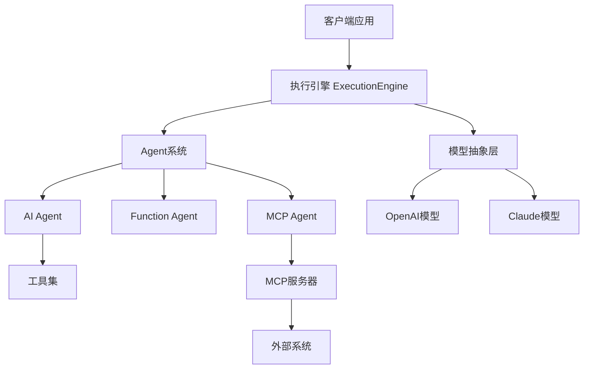
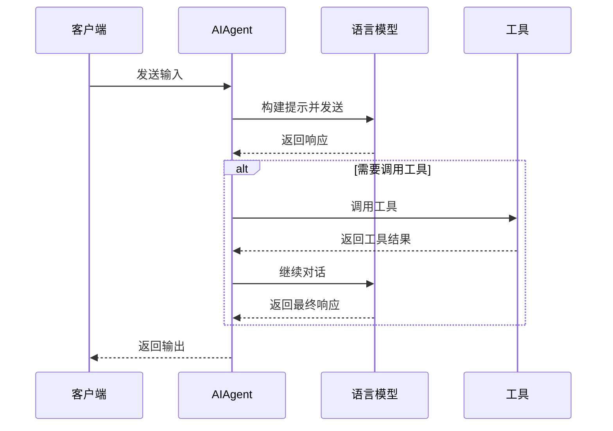
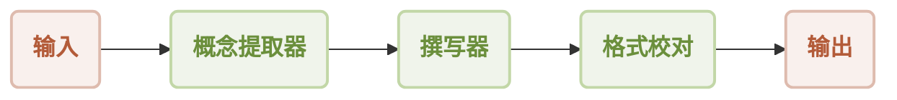
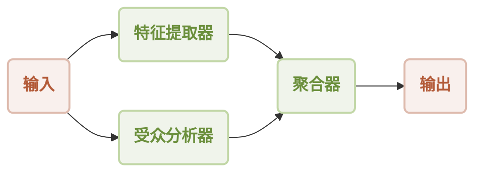
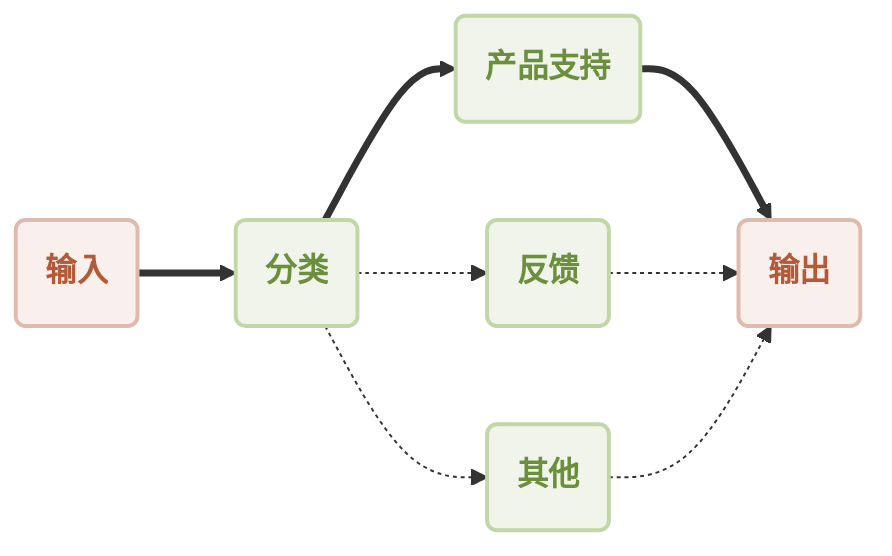
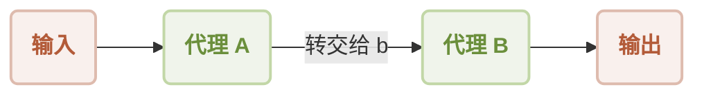
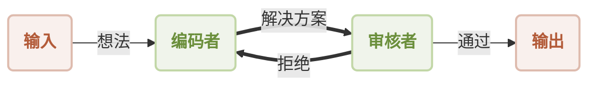
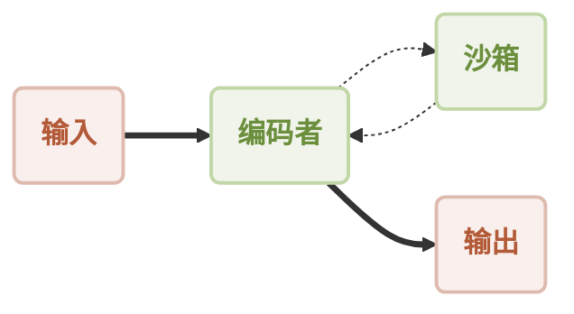
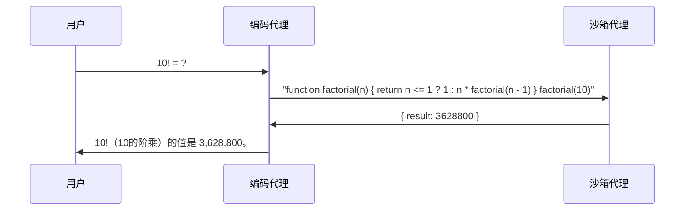
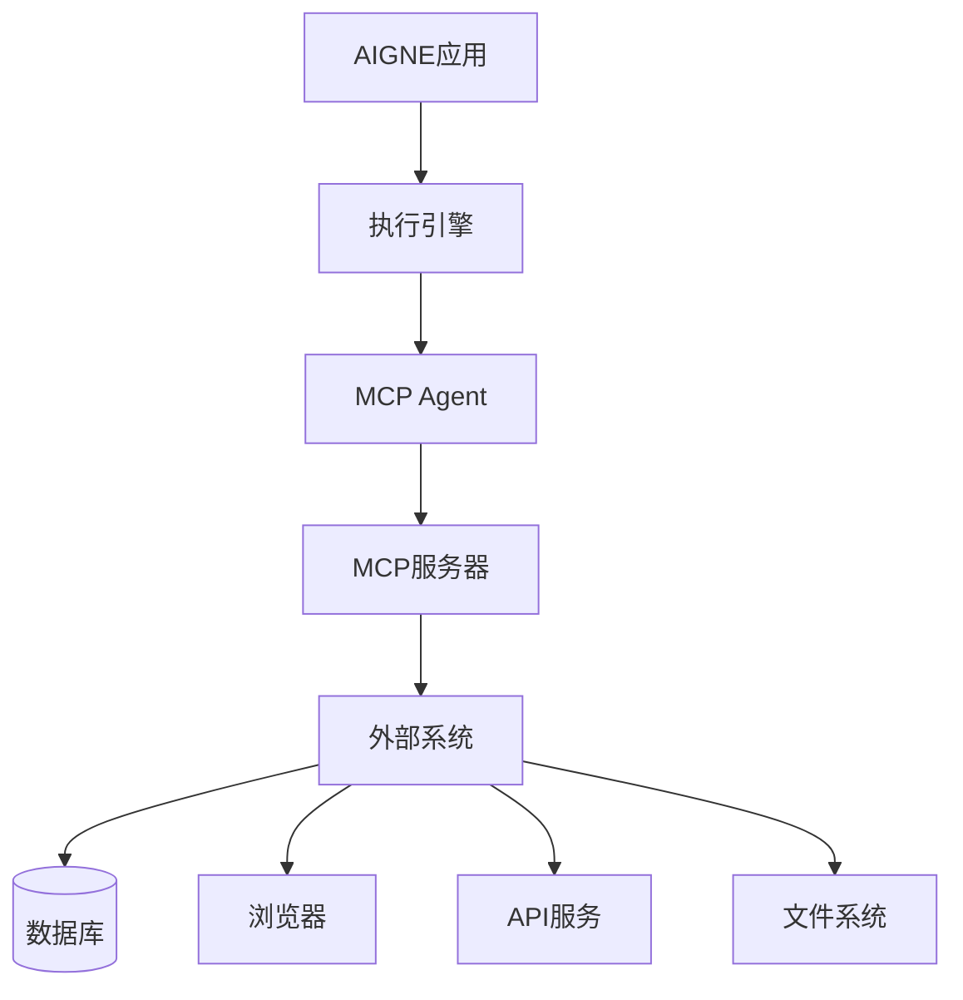

# AIGNE Framework

AIGNE Framework是一个功能型AI应用开发框架，旨在简化和加速现代应用程序的构建过程。它结合了函数式编程特性、强大的人工智能能力和模块化设计原则，帮助开发者轻松创建可扩展的解决方案。AIGNE Framework还深度集成了Blocklet生态系统，为开发者提供丰富的工具和资源。

## 核心特性

- **模块化设计**：采用清晰的模块化结构，开发者可以轻松组织代码，提高开发效率，简化维护工作。
- **TypeScript支持**：提供全面的TypeScript类型定义，确保类型安全并增强开发体验。
- **Blocklet生态系统集成**：与Blocklet生态系统紧密集成，为开发者提供一站式开发和部署解决方案。
- **多种工作流模式**：支持多种工作流模式，满足不同AI应用需求，包括顺序工作流、并发工作流、路由工作流等。
- **AI模型抽象**：提供统一的AI模型抽象层，支持OpenAI、Claude等多种大型语言模型。

## 框架架构

AIGNE Framework采用模块化架构设计，主要由以下几个核心组件构成：

### 架构概览

### 核心概念

- **Chat Model**：与大型语言模型交互的抽象基类
- **Agent**：工作流的基本构建块，每个Agent都有特定的指令和处理输入产生输出的能力
- **Workflow**：多个Agent组合形成的工作流程，用于解决复杂任务
- **Execution Engine**：工作流的运行时环境，负责协调Agent之间的通信和执行流程

## 关键组件

### Agent

Agent是AIGNE Framework的核心概念，代表一个可以接收输入并产生输出的实体。所有特定类型的Agent都继承自这个基类。

Agent基类提供了以下功能：
- 输入/输出验证
- 工具调用能力
- 内存管理
- 事件订阅与发布

### AIAgent

AIAgent是用于与AI模型交互的Agent实现，可以发送提示给AI模型，处理返回的结果，并支持工具调用功能。

### FunctionAgent

FunctionAgent允许开发者将常规JavaScript函数封装为Agent，使其可以在AIGNE工作流中使用。这对于集成现有代码或执行特定功能非常有用。

### MCPAgent

MCPAgent通过Model Context Protocol连接到外部服务器，扩展AI应用的能力范围。这使得AI可以与各种外部系统集成，如数据库、网络浏览器等。

### 执行引擎 (Execution Engine)

执行引擎是AIGNE框架的核心组件，负责协调Agent之间的交互和执行工作流。它提供了一个统一的接口来运行单个或多个Agent，并管理它们之间的消息传递。

## 工作流模式

AIGNE Framework支持多种工作流模式，每种模式适用于不同的场景：

### 顺序工作流

多个Agent按顺序执行，每个Agent的输出作为下一个Agent的输入。

### 并发工作流

多个Agent并行执行，处理相同的输入，然后合并它们的输出。

### 路由工作流

基于输入内容动态选择合适的Agent处理。

### 交接工作流

Agent之间无缝转交任务，实现专业分工。

### 反思工作流

通过反馈循环实现自我改进，使输出更加精确和高质量。

### 代码执行工作流

安全地在AI驱动的工作流中执行动态生成的代码。

代码执行工作流交互序列：

## 集成能力

AIGNE Framework支持多种集成方式，允许AI应用与外部系统交互：

### MCP服务器集成

Model Context Protocol (MCP) 是一种标准化协议，允许AI模型与外部系统交互。AIGNE Framework提供了多种MCP服务器实现：

- **Puppeteer MCP服务器**：利用Puppeteer进行自动化网页抓取和浏览器操作
- **SQLite MCP服务器**：通过模型上下文协议连接SQLite进行数据库操作
- **GitHub MCP服务器**：与GitHub仓库交互，进行代码分析、提交查看等操作

### 外部系统集成架构

## 应用场景

AIGNE Framework适用于多种AI应用场景：

### 内容生成与处理

利用顺序工作流和反思工作流，创建高质量的内容生成管道，包括概念提取、内容撰写、格式校对等步骤。

### 智能客服与路由

使用路由工作流实现智能客服系统，根据用户查询类型将请求路由到适当的专业Agent处理。

### 数据分析与处理

结合并发工作流和代码执行工作流，从多个角度分析数据，并执行动态生成的分析代码。

### Web自动化与数据抓取

通过Puppeteer MCP服务器，实现复杂的Web自动化操作和数据抓取任务。

### 数据库操作与查询

利用SQLite MCP服务器，允许AI应用直接查询和操作数据库，为数据驱动的AI应用提供支持。

## 结论

AIGNE Framework提供了一套全面的工具和抽象，简化了AI应用的开发过程。通过模块化设计、多种工作流模式和强大的集成能力，开发者可以快速构建复杂的AI应用，而无需处理底层细节。

框架的核心优势在于：
1. 简化了AI应用的开发复杂度
2. 提供了多种工作流模式满足不同需求
3. 支持与外部系统的无缝集成
4. 强大的TypeScript类型支持提升开发体验
5. 与Blocklet生态系统深度集成，简化部署和运维
