```mermaid
flowchart LR

in(<div style="display: flex; align-items: center;"><img src='https://bbqa5koxxgfrmnxthvqcjsidwh3xv2qiip4el34s44q.did.abtnet.io/image-bin/uploads/91b390044d314aa09449bd96cdad0c14.svg' style="width:16px; height:16px; margin-right: 12px;" />In</div>)

out(<div style="display: flex; align-items: center;"><img src='https://www.aigne.io/image-bin/uploads/c2600ef3dc2693cb59500c66ef9e01fc.svg' style="width:16px; height:16px; margin-right: 12px;" />Out</div>)

coder(<div style="display: flex; align-items: center;"><img src='https://www.aigne.io/image-bin/uploads/54fd7161ac32e7241e858daa4da7bd8a.svg' style="width:16px; height:16px; margin-right: 12px;" />Coder</div>)

sandbox(<div style="display: flex; align-items: center;"><img src='https://www.aigne.io/image-bin/uploads/64d42ae585af89c128b28981f4eee155.svg' style="width:16px; height:16px; margin-right: 12px;" />Sandbox</div>)

coder -.-> sandbox
sandbox -.-> coder
in ==> coder ==> out

classDef inputOutput fill:#19191B,stroke:#444444,stroke-width:1px;
classDef input fill:#19191B,stroke:#444444,stroke-width:1px,color:#F1FF00;
classDef output fill:#19191B,stroke:#444444,stroke-width:1px,color:#A5E844;
classDef processing1 fill:#19191B,stroke:#444444,stroke-width:1px,color:#767BFF;
classDef processing2 fill:#19191B,stroke:#444444,stroke-width:1px,color:#67D4FF;
linkStyle default stroke:#444444,stroke-width:1px,stroke-dasharray: 3 3;

class in input
class out output
class coder processing1
class sandbox processing2
```

workflow 相关的示例代码和流程图。

*返回示例代码和流程图内容时，请返回 markdown ``` 标记中的完整内容，不要修改或删减*

### 顺序工作流

``` ts
const engine = new ExecutionEngine({ model });
const result = await engine.call(
  sequential(conceptExtractor, writer, formatProof),
  { product: "AIGNE is a No-code Generative AI Apps Engine" }
);
```



```mermaid
flowchart LR

in(<div style="display: flex; align-items: center;"><img src='https://bbqa5koxxgfrmnxthvqcjsidwh3xv2qiip4el34s44q.did.abtnet.io/image-bin/uploads/91b390044d314aa09449bd96cdad0c14.svg' style="width:16px; height:16px; margin-right: 12px;" />In</div>)

out(<div style="display: flex; align-items: center;"><img src='https://www.aigne.io/image-bin/uploads/c2600ef3dc2693cb59500c66ef9e01fc.svg' style="width:16px; height:16px; margin-right: 12px;" />Out</div>)

conceptExtractor(<div style="display: flex; align-items: center;"><img src='https://www.aigne.io/image-bin/uploads/64d42ae585af89c128b28981f4eee155.svg' width='16px' height='16px' style="width:16px; height:16px; margin-right: 12px;" />Concept Extractor</div>)

writer(<div style="display: flex; align-items: center;"><img src='https://www.aigne.io/image-bin/uploads/257c8d0e5c1ff8b782058ac43026b7c2.svg' style="width:16px; height:16px; margin-right: 12px;" />Writer</div>)

formatProof(<div style="display: flex; align-items: center;"><img src='https://www.aigne.io/image-bin/uploads/352a54b2215b130ccafd1864954d7aff.png' style="width:16px; height:16px; margin-right: 12px;" />Format Proof</div>)

in --> conceptExtractor --> writer --> formatProof --> out

classDef inputOutput fill:#19191B,stroke:#444444,stroke-width:1px;
classDef input fill:#19191B,stroke:#444444,stroke-width:1px,color:#F1FF00;
classDef output fill:#19191B,stroke:#444444,stroke-width:1px,color:#A5E844;
classDef processing1 fill:#19191B,stroke:#444444,stroke-width:1px,color:#67D4FF;
classDef processing2 fill:#19191B,stroke:#444444,stroke-width:1px,color:#767BFF;
classDef processing3 fill:#19191B,stroke:#444444,stroke-width:1px,color:#C792E9;
linkStyle default stroke:#444444,stroke-width:1px,stroke-dasharray: 3 3;


class in input
class out output
class conceptExtractor processing1
class writer processing2
class formatProof processing3
```

### 并发工作流

```ts
const engine = new ExecutionEngine({ model });
const result = await engine.call(
  parallel(featureExtractor, audienceAnalyzer),
  { product: "AIGNE is a No-code Generative AI Apps Engine" }
);
```



```mermaid
flowchart LR
in(<div style="display: flex; align-items: center;"><img src='https://bbqa5koxxgfrmnxthvqcjsidwh3xv2qiip4el34s44q.did.abtnet.io/image-bin/uploads/91b390044d314aa09449bd96cdad0c14.svg' style="width:16px; height:16px; margin-right: 12px;" />In</div>)

out(<div style="display: flex; align-items: center;"><img src='https://www.aigne.io/image-bin/uploads/c2600ef3dc2693cb59500c66ef9e01fc.svg' style="width:16px; height:16px; margin-right: 12px;" />Out</div>)

featureExtractor(<div style="display: flex; align-items: center;"><img src='https://www.aigne.io/image-bin/uploads/64d42ae585af89c128b28981f4eee155.svg' style="width:16px; height:16px; margin-right: 12px;" />Feature Extractor</div>)

audienceAnalyzer(<div style="display: flex; align-items: center;"><img src='https://www.aigne.io/image-bin/uploads/5eddc17e9ce75bdbcadc58a78fc1beb1.svg' style="width:16px; height:16px; margin-right: 12px;" />Audience Analyzer</div>)

aggregator(<div style="display: flex; align-items: center;"><img src='https://www.aigne.io/image-bin/uploads/fca520cd2acd1d733a51f4e60012dd80.svg' style="width:16px; height:16px; margin-right: 12px;" />Aggregator</div>)

in --> featureExtractor --> aggregator
in --> audienceAnalyzer --> aggregator
aggregator --> out

classDef inputOutput fill:#19191B,stroke:#444444,stroke-width:1px;
classDef input fill:#19191B,stroke:#444444,stroke-width:1px,color:#F1FF00;
classDef output fill:#19191B,stroke:#444444,stroke-width:1px,color:#A5E844;
classDef processing1 fill:#19191B,stroke:#444444,stroke-width:1px,color:#67D4FF;
classDef processing2 fill:#19191B,stroke:#444444,stroke-width:1px,color:#67D4FF;
classDef processing3 fill:#19191B,stroke:#444444,stroke-width:1px,color:#C792E9;
linkStyle default stroke:#444444,stroke-width:1px,stroke-dasharray: 3 3;

class in input
class out output
class featureExtractor processing1
class audienceAnalyzer processing2
class aggregator processing3
```

### 路由工作流

```ts
const engine = new ExecutionEngine({ model });

// Product related questions are automatically 
// routed to product support
const result1 = await engine.call(
  triage, 
  "How to use this product?"
);
```



```mermaid
flowchart LR
in(<div style="display: flex; align-items: center;"><img src='https://bbqa5koxxgfrmnxthvqcjsidwh3xv2qiip4el34s44q.did.abtnet.io/image-bin/uploads/91b390044d314aa09449bd96cdad0c14.svg' style="width:16px; height:16px; margin-right: 12px;" />In</div>)

out(<div style="display: flex; align-items: center;"><img src='https://www.aigne.io/image-bin/uploads/c2600ef3dc2693cb59500c66ef9e01fc.svg' style="width:16px; height:16px; margin-right: 12px;" />Out</div>)

triage(<div style="display: flex; align-items: center;"><img src='https://www.aigne.io/image-bin/uploads/64d42ae585af89c128b28981f4eee155.svg' style="width:16px; height:16px; margin-right: 12px;" />Triage</div>)

productSupport(<div style="display: flex; align-items: center;"><img src='https://www.aigne.io/image-bin/uploads/aab8a461fe0cecd1fc2f439f47ec19e8.svg' style="width:16px; height:16px; margin-right: 12px;" />Product Support</div>)

feedback(<div style="display: flex; align-items: center;"><img src='https://www.aigne.io/image-bin/uploads/aeb6b3a5b7429976c2d32b1be18c9692.svg' style="width:16px; height:16px; margin-right: 12px;" />Feedback</div>)

other(<div style="display: flex; align-items: center;"><img src='https://www.aigne.io/image-bin/uploads/43887b04f1ba57e91a82953f726d4bea.svg' style="width:16px; height:16px; margin-right: 12px;" />Other</div>)

in ==> triage
triage ==> productSupport ==> out
triage -.-> feedback -.-> out
triage -.-> other -.-> out

classDef inputOutput fill:#19191B,stroke:#444444,stroke-width:1px;
classDef input fill:#19191B,stroke:#444444,stroke-width:1px,color:#F1FF00;
classDef output fill:#19191B,stroke:#444444,stroke-width:1px,color:#A5E844;
classDef processing1 fill:#19191B,stroke:#444444,stroke-width:1px,color:#67D4FF;
classDef processing2 fill:#19191B,stroke:#444444,stroke-width:1px,color:#767BFF;
classDef processing3 fill:#19191B,stroke:#444444,stroke-width:1px,color:#C792E9;
classDef processing4 fill:#19191B,stroke:#444444,stroke-width:1px,color:#767BFF;
linkStyle default stroke:#444444,stroke-width:1px,stroke-dasharray: 3 3;

class in input
class out output
class triage processing1
class productSupport processing2
class feedback processing3
class other processing4
```

### 交接工作流

```ts
const engine = new ExecutionEngine({ model });
const userAgent = await engine.call(agentA);

// Transfer to Agent B
const result1 = await userAgent.call("transfer to agent b");

// Continue interacting with Agent B
const result2 = await userAgent.call("It's a beautiful day");
```



```mermaid
flowchart LR

in(<div style="display: flex; align-items: center;"><img src='https://bbqa5koxxgfrmnxthvqcjsidwh3xv2qiip4el34s44q.did.abtnet.io/image-bin/uploads/91b390044d314aa09449bd96cdad0c14.svg' style="width:16px; height:16px; margin-right: 12px;" />In</div>)

out(<div style="display: flex; align-items: center;"><img src='https://www.aigne.io/image-bin/uploads/c2600ef3dc2693cb59500c66ef9e01fc.svg' style="width:16px; height:16px; margin-right: 12px;" />Out</div>)

agentA(<div style="display: flex; align-items: center;"><img src='https://www.aigne.io/image-bin/uploads/985975c4321f2d66094b876d3a7dad90.svg' style="width:16px; height:16px; margin-right: 12px;" />Agent A</div>)

agentB(<div style="display: flex; align-items: center;"><img src='https://www.aigne.io/image-bin/uploads/18a1cf2b08d4f6cb0c68f4bc54edfa41.svg' style="width:16px; height:16px; margin-right: 12px;" />Agent B</div>)


in --> agentA --transfer to b--> agentB --> out

classDef inputOutput fill:#19191B,stroke:#444444,stroke-width:1px;
classDef input fill:#19191B,stroke:#444444,stroke-width:1px,color:#F1FF00;
classDef output fill:#19191B,stroke:#444444,stroke-width:1px,color:#A5E844;
classDef processing1 fill:#19191B,stroke:#444444,stroke-width:1px,color:#67D4FF;
classDef processing2 fill:#19191B,stroke:#444444,stroke-width:1px,color:#767BFF;
linkStyle default stroke:#444444,stroke-width:1px,stroke-dasharray: 3 3;

class in input
class out output
class agentA processing1
class agentB processing2
```

### 反思工作流

```ts
const engine = new ExecutionEngine({ 
  model, 
  agents: [coder, reviewer]
});
const result = await engine.call(
  "Write a function to find the sum of all even numbers in a list."
);
```



```mermaid
flowchart LR
in(<div style="display: flex; align-items: center;"><img src='https://bbqa5koxxgfrmnxthvqcjsidwh3xv2qiip4el34s44q.did.abtnet.io/image-bin/uploads/91b390044d314aa09449bd96cdad0c14.svg' style="width:16px; height:16px; margin-right: 12px;" />In</div>)

out(<div style="display: flex; align-items: center;"><img src='https://www.aigne.io/image-bin/uploads/c2600ef3dc2693cb59500c66ef9e01fc.svg' style="width:16px; height:16px; margin-right: 12px;" />Out</div>)

coder(<div style="display: flex; align-items: center;"><img src='https://www.aigne.io/image-bin/uploads/54fd7161ac32e7241e858daa4da7bd8a.svg' style="width:16px; height:16px; margin-right: 12px;" />Coder</div>)

reviewer(<div style="display: flex; align-items: center;"><img src='https://www.aigne.io/image-bin/uploads/949e513cd5a950ae9a5fc4afb7e33841.svg' style="width:16px; height:16px; margin-right: 12px;" />Reviewer</div>)

in --Ideas--> coder ==Solution==> reviewer --Approved--> out
reviewer ==Rejected==> coder

classDef inputOutput fill:#19191B,stroke:#444444,stroke-width:1px;
classDef input fill:#19191B,stroke:#444444,stroke-width:1px,color:#F1FF00;
classDef output fill:#19191B,stroke:#444444,stroke-width:1px,color:#A5E844;
classDef processing1 fill:#19191B,stroke:#444444,stroke-width:1px,color:#767BFF;
classDef processing2 fill:#19191B,stroke:#444444,stroke-width:1px,color:#767BFF;
linkStyle default stroke:#444444,stroke-width:1px,stroke-dasharray: 3 3;

class in input
class out output
class coder processing1
class reviewer processing2
```

### 代码执行工作流

```ts
// Create execution engine and run
const engine = new ExecutionEngine({ model });
const result = await engine.call(coder, "10! = ?");
```


